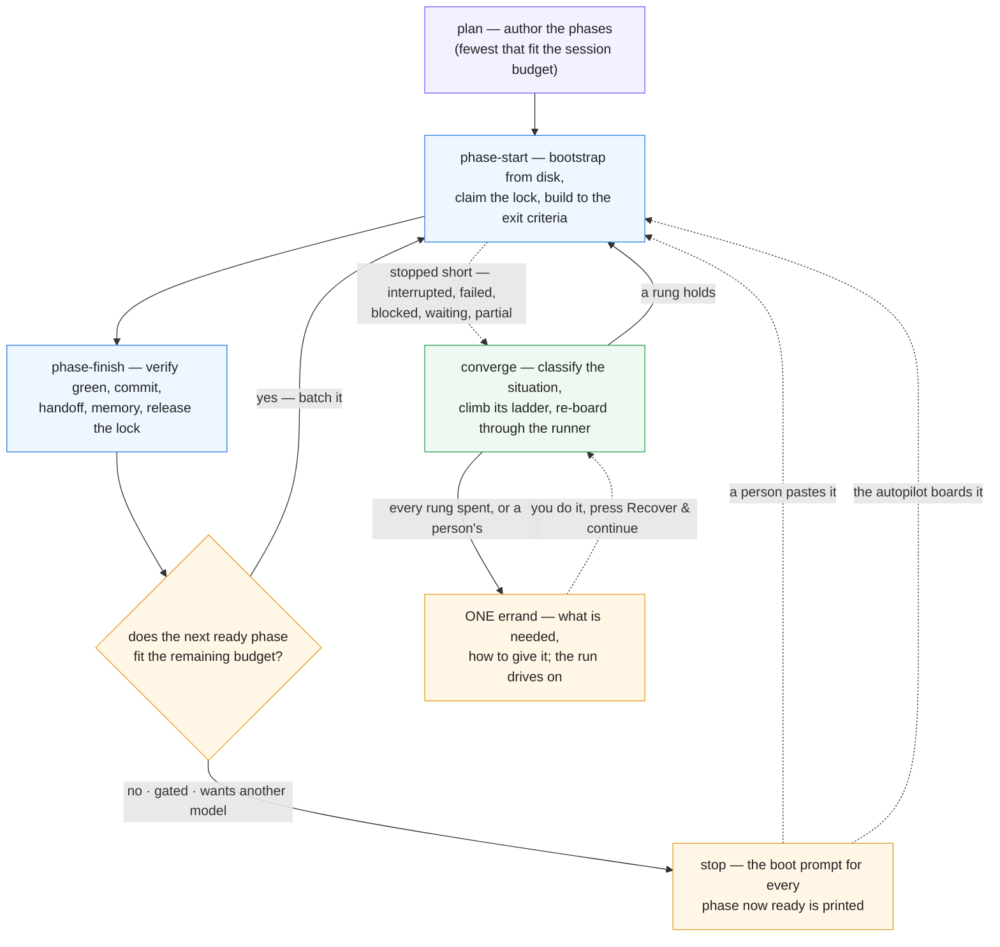

# The loop

> The autopilot's specification. How a plan runs itself, how a stopped phase is *read* rather than
> guessed at, what the machine tries before it asks you, how sessions see each other, and what is
> still — deliberately — a person's. The hand-driven procedure is `SKILL.md`; the console's controls
> are [What you control](controls.md) and [`viewer/README.md`](../viewer/README.md) §The autopilot.
> Everything below names the code that does it, so a claim can be checked against the thing.

## Three modes, one property

A session runs in one of three modes it picks itself: **plan** (no plan exists — author the phases and
start the roots), **phase-start** (bootstrap a phase from disk, claim it, build it), **phase-finish**
(verify, commit, hand off, batch into the next phase or stop). The property the whole system stands on:
**phase-start bootstraps from disk only** — the plan, the dependency handoffs, the memory entry, the
board (`scripts/phase-graph.sh`, the only truth for done / ready / waiting). A fresh session that
cannot start cold from those was handed a deficient handoff, and *that* is the bug to fix.



The dashed edges are what changed in 2.3.0. **Stop is not terminal** any more: a phase that stopped
short is classified and climbed; the boot prompt is still the only author of a fresh boarding
(`phase-graph.sh --boot-prompt`), but the runner may append a brief to it (`resume` · `unblock` ·
`continue` · `closeout`) and may `--resume` the phase's own session instead. The disk-only invariant
therefore holds for the **fresh** brief and is deliberately relaxed for the others — a resumed
session keeps its context on purpose.

## The autopilot in one paragraph

Phase Console's runner (`viewer/server/runner/`) drives a plan with **one unattended `claude -p` per
phase**, the board from `phase-graph.sh`, the §Verification commands from the plan, the handoff from
the session. A session tells the runner how it ended through the **outcome protocol**
(`scripts/phase-outcome.sh` → one JSON file at `PE_OUTCOME_FILE`: `complete` · `blocked` ·
`needs-human` · `waiting-external` · `partial` · `no-defect`); prose never counts. The runner verifies, re-reads the
board, and boards whatever is ready next under the scheduler's admission (scopes, locks, usage). Every
automatic act is a journal line on the run (`runs/<instance>/<slug>/run-<id>.jsonl`), bounded by count
**and dollars**, and yields to an operator's Stop. The CONVERGENCE loop never dispatches a reviewer; the
ladder does, as a rung inside a run — `qa-pending` resumes the phase's own session and asks it to
dispatch the fresh-context subagent the gate requires, and `qa-failed` asks for a fresh one and a new
verdict. That paragraph was
true before 2.3.0; what follows is what it does when a phase does **not** simply finish.

## Situations — reading a stopped phase

`viewer/server/runner/situation.ts` collects **evidence** for a phase once — the board's word
(`phase-graph.sh --memory-block`), the handoff (`{exists, status, outstanding}`), the run's record
(status, attempts, session, verification, closeout, halt kind), the lock (`phase-lock.sh status`:
owner, host, lease, `session=`, and the registry's presence for it), work in the tree (dirty files,
commits since the attempt), the transcript (turns, cost), a declared outcome, the gate kind, the MCP
preflight, health issues, a live-session hit — and `classifySituation(evidence)` (pure) answers with
**one** of sixteen words. The vocabulary is `viewer/shared/situation-model.js`, imported by the server,
the client and the tests by identity, so a chip, a journal line and an errand can never disagree.

| id | actor | label | it means |
|---|---|---|---|
| `superseded` | none | Superseded | the board reads the phase done; the record is history |
| `qa-failed` | machine | QA failed | a recorded `fail` holds the dependents — the ladder retries the verdict |
| `qa-pending` | machine | QA pending | the plan gates on QA and none is recorded — nobody scheduled the review |
| `foreign-live` | wait | Another session is in it | a LIVE session holds the lock — queue, never fight |
| `foreign-stale` | machine | Stale foreign claim | an expired claim over unfinished work, nobody in it |
| `waiting-external` | wait | Waiting on the outside | the session declared a clock it does not control |
| `gated-manual` | person | Gate needs a person | a `manual` gate, unapproved |
| `mcp-unavailable` | machine | MCP server unreachable | a server the phase needs did not connect |
| `resource-wall` | machine | Resource wall | `:usage` `:auth` `:budget` `:model` |
| `blocked-declared` | machine | Declared blocked | the handoff says blocked — `:lock` `:permission` `:credential` `:gate` `:external` `:unknown` |
| `plan-broken` | machine | Plan needs repair | lint, an unreadable plan, no runnable §Verification (`:lint` `:unreadable` `:verification` `:<issue>`) — **only when nothing was declared** |
| `verify-red` | machine | Verification red | the work is there; §Verification is not green |
| `done-unrecorded` | machine | Done, unrecorded | verification green, no complete handoff |
| `work-in-progress` | machine | Work in progress | started, not finished (an `in-progress` handoff, a dirty tree, a `partial`) |
| `never-started` | machine | Never started | no work, no handoff — the session died in bootstrap. **Sub-kinds read from the exit's own words** (`classifyExitSaid`): `sleep`, `refusal`, `skill-missing` — 40 of 226 sessions exited `turns: 0, costUsd: 0`, and their `said` named three different causes that all took the one rung `reboard-fresh`. An exit naming none of the three keeps the bare situation and the old path |
| `unknown` | person | Unclassified | fits nothing above — a person reads the evidence |

**Testimony outranks the console's own claim about the paperwork.** `blocked-declared` sits ABOVE
`plan-broken` (2026-08-30): a session that declared a blocker, or wrote a `blocked` handoff, is saying
what is wrong with the phase, while the commonest plan-health error — `stale-handoff` — is raised BY
that very handoff. The console answered "the box is unreachable" with "your plan is broken, run
validate.sh" 92 times, for plans whose `validate.sh` was green. All three `plan-broken` arms are now
guarded by "nothing declared a park or a blocker", `stale-handoff` is a **warning** rather than an
error, and when a `plan-broken` card is raised it quotes the issue that raised it instead of
prescribing a lint that is already passing.

**A halt is either about the phase or about the run.** `shared/recovery-model.js` splits `HALT_KINDS`
into `PHASE_HALT_KINDS` (`verify-failed` · `no-handoff` · `phase-blocked` · `needs-human` ·
`awaiting-person` · `waiting-external-timeout` · `verification-preflight` · `mcp-preflight` ·
`recovery-failed` · `orphaned-session` · `phase-crashed` · `worktree-merge`) and `RUN_HALT_KINDS` (`budget` ·
`failure-streak` · `models-exhausted` · `run-preflight` · `plan-unreadable` · `plan-lint` ·
`runner-crashed` · `plan-deadlocked` · `nothing-ready` · `interrupted-by-restart` · `operator-stop` ·
`credential-refused`).
The four before the last are the parks and stops that used to carry no kind at all (LFC-1); the last is the
API refusing the run's OWN credential — an organisation policy, an expired login, a billing hold, a
certificate — which stops the run and retires the account for its organisation (RCV-1: it used to ride
`needs-human`, a PHASE-level kind, so one blocked credential settled the phase and the loop boarded the next
into the same wall, ten times in 157 s), and
`viewer/test/docs-parity.test.ts` holds both lists here to the arrays, member for member. The
credential wall stamps its evidence on the record — `record.cause {kind: 'credential-refused', class,
reason, at, account?}`, which the classifier reads as `resource-wall:auth` whatever a later rung's result
looks like — charges the streak, and writes ONE run-level `run.errand` carrying the session's own words
(`said`). The boarding door asks the machine-wide breaker again at every boarding, so a phase queued
before another run retired the account is refused before a session is spent
(`run.admission-refused {reason: 'account-retired'}`, the same halt); and a resume whose preflight
passes — a person cleared the account, or switched the run — re-boards every record the wall parked
(`phase.retry-requested {by: 'console'}`). A
phase-level kind calls `settlePhase()`, which writes `record.halt` and leaves the
run driving its other candidates; a run-level kind calls `halt()` and stops everything. Before the
split, one phase's red verification drained every queued sibling lane — `phase.not-started` "the run
was stopped / halted while this phase waited for its scope" appears **125×** in the corpus, re-read
later as `never-started` and answered by re-boarding phases that had never had a chance. What still
stops a genuinely broken plan is the **streak**: `settlePhase` asks `failure-streak` on every
phase-level ending. The counter it reads is `consecutiveFailures`, which counts phase ATTEMPTS that ended
badly — every `consecutiveFailures++` site is an attempt (a red verification, a missing handoff, a declared
blocker, a refused credential); a ladder exhaustion is deliberately not one (`parkWithErrand`), and a
`recheck` recovery, which spawns nothing, charges nothing (RCV-4). Only a person's press — Continue, Retry,
Recover & continue — resets it (RCV-3), and a press is read off the start's ACTOR, never its verb:
`stoppedByOf` (`viewer/server/actor.ts`) answers `operator` for a request, a signal or a hook body and
`system` for the console's own `timer`, `boot` and `event` (`ACTOR_VIAS`). The convergence loop's
relaunch, the healer's rungs, a watch landing and a boot re-adoption are all `system`, and all carry it forward, and a run whose streak is spent is refused an automatic
relaunch (`run.relaunch-refused`; the planner never proposes one for a `failure-streak` or
`credential-refused` halt — `PRESS_ONLY_HALT_KINDS`). A recovery that confirms a phase done resets it too:
a success breaks "N in a row" by definition. The classifier reads `rec.halt ?? state.halt`.

**Recover and recheck keep ledgers of their own** (RCV-4). The operator's recover verb counts per phase
on `recoveries[phase].recovers`: past `RECOVER_MAX_PER_PHASE` (6) it is refused `capped`, and over the
same evidence fingerprint the last recovery ran under it is refused `unchanged` — each a
`run.recover.refused {phase, why, recovers, max}` line rather than a session spent learning nothing
(`preRecoveryGate` asks both; the healer's own calls never do, its dedup is the situation
fingerprint). A `recheck` re-runs the checks and spawns nothing, so it writes no second halt: its
verdict is one `run.recheck {verdict: confirmed|unchanged|changed}`, and an `unchanged` recheck
restores the status word and sentence the card showed and keeps the standing halt's `at`.

**A declaration is spent by the session, not by the boarding.** `record.declared` is deleted only by
`consumeDeclaration(record, why)` under four named licences — `new-outcome` (the session declared
something else), `board-closed` (the board now reads the phase done), `session-productive` (a resumed
session made DURABLE progress — a commit or a `phase-outcome.sh` call, `isDurableProgress`; a turn or a
`git status` proves the session exists, not that it said anything about its wait, and the measured
resume that spent its declaration 0.8 s in then produced nothing, WAI-4) and `retry` (a person
superseded it) — each
journalled `phase.declaration-consumed`. Boarding used to delete it BEFORE the spawn, so a resume that
queued, hit the lock-wait cap or failed to start lost the testimony for good, and the phase's next
classification read "no handoff, no declaration" and called the plan broken.

The **actor** is the hinge: `machine` has a ladder; `person` gets an errand at once; `wait` settles
itself; `none` is nothing wrong. Classification is journalled as `phase.situation {situation, sub,
label, why[], by, fingerprint?}` — `by` is who classified, one of `CLASSIFIED_BY` (`drive` · `outcome` ·
`closed` · `heal`), and `phase.rung` carries the same word — and cached on the record
(`PhaseRecord.situation {key, at, why, fingerprint?, by?}`) for the table and the Ways-forward strip. The
healer writes the line once per evidence: a pass that re-derives the same key from the same fingerprint
journals nothing (RCV-9 counted 1 332 lines of "still parked", 1 249 of them unsigned), and its console
log line `run.heal-pass` counts what it `journalled` against what was `unchanged`. The diagnosis endpoint (`GET /api/run/:slug/diagnosis/:phase`) returns the
situation with the evidence lines it read.

## The ladder — what the machine tries before it asks

`viewer/server/runner/ladder.ts` climbs; the **table** is `viewer/shared/ladder-model.js`
(`RUNGS_BY_SITUATION`), so the client shows the same rungs in the same words. Per situation, an
ordered list of **rungs** — a vehicle plus parameters — climbed in order, **never the same rung twice
for one situation on one phase**, and bounded by the caps below. A rung's record is pushed *before*
the spend (`accountRung`: `phase.rung {situation, rung, params, brief, vehicle, attempt}`) and settled
when the session ends (`settleRung`, with one of `RUNG_OUTCOMES`' verdicts: `fixed` · `no-defect` ·
`superseded` · `failed` · `interrupted`, plus `work-in-progress` for a session that declared `partial`
and asked to be resumed; `running` is the word while it climbs), so a console that dies mid-rung
still remembers it tried.

**The settlement doors, and a backstop behind them.** The outcome-driven settles are one door; the
other is `settleRungsAfterAttempt` (`runner-base.ts`), which runs when a lane's attempt ends and
settles every rung still open that was climbed BEFORE the lane started — done → `fixed`, a declared
park → `no-defect`, an interruption (or a re-board hint the ladder already acted on) → `interrupted`,
anything else `failed` naming the status — journalled `phase.rung-settled {…, by: 'attempt-end'}`. A
lane that ended at the gate, the queue or a preflight park spawned nothing and settles nothing (RCV-6:
21 of 168 records had kept a rung `running` past its attempt, booking every later attempt's spend on it).

Every rung states its **driver** (`VEHICLE_DRIVERS` in the shared file, `drivableBy(vehicle)` —
phase 10, LFC-2/RCV-10): `console` — the console itself, the runner's own boarding or resume, a park
on a clock it arms, an account it picks, a card it offers; `writes` — the console under
`--allow-writes`; `agent` — a fresh briefed session or pty agent (`--allow-run`, else
`--allow-agent`); `never` — operator-only, no console drives it (no row today; the word exists so a
future one has a place to say why). A table whose every row this console cannot drive **escalates
exactly as an exhausted one does** — one errand naming each rung and why it is unavailable, never a
`phase.ladder-deferred` for a table nothing will ever climb; a rung only the healer can drive on a
stopped run is what `phase.ladder-deferred` still means. `test/ladder.test.ts` holds every key of the
table to one of these: some rung drivable, or `nextRung(available)` exhausted, or operator-only
with a reason; and holds every label below verbatim to the model's.

| situation | rungs, in climb order (→ an errand at the end) | driver |
|---|---|---|
| `never-started` | **Re-board fresh** (the engine's boot prompt; the record resets to pending) | console |
| `never-started:sleep` | **Resume the same session** (`--resume` — the machine slept mid-response, so the transcript is intact and a fresh board would throw it away) → **Re-board fresh** | console · console |
| `never-started:refusal` | *(no rungs — an errand at once)* the same prompt gets the same refusal, so re-boarding is spending to learn nothing; the cause rides the errand's `why` and `said` (`REFUSAL_CAUSES`: `aup` · `org-policy` · `org-subscription` · `certificate`), and none of them changes on a re-board | — |
| `never-started:skill-missing` | *(no rungs — an errand at once)* the CLI answered `Unknown command:`; the next attempt runs the same broken install | — |
| `work-in-progress` | **Continue in its own session** (`--resume`, "you are RESUMING — read git status first") → **Board fresh with a resume brief** → **Board fresh, stronger** (next model/effort) | console · console · console |
| `done-unrecorded` | **Finish in its own session** (verify, commit, handoff — nothing else) → **Close out with a new agent** | console · agent |
| `verify-red` | **Resume with the failure** (the failing commands and their output) → **Fix with a stronger new agent** | console · agent |
| `qa-pending` | **Run QA and record the verdict** (resumes the phase's own session to dispatch the fresh-context QA subagent the plan's gate requires, then record `pass`/`fail`/`waived` with `qa-record.sh`) → **Review with a fresh session** (a session boarded from the boot prompt, through the QA loop's `qa-rerun`, for a phase whose own session cannot be resumed) | console · agent |
| `qa-failed` | **Fix what QA found, then re-record** (its own session, carrying the report) → **Fix what QA found with a new agent** (a fresh agent at a stronger model) | console · agent |
| `blocked-declared:lock` | **Queue behind the lock** (woken by the docs watcher, the lease, the idle poll) | console |
| `blocked-declared:external` | **Park and poll the refs** (drivable on exactly the machine-checkable refs the session named — a declaration WITH refs never reaches the ladder, the watch clock owns it) → **Park for a while** (`LADDER_TIMED_PARK_MS`, 30 min; the phase's own session then re-checks the blocker and declares a `--watch` ref or continues) | console · console |
| `blocked-declared:unknown` | **One bounded unblock session** — the own session (or a fresh one with an unblock brief) carrying the Outstanding text, explicitly allowed to do the work | console |
| `blocked-declared:credential` / `:gate` | — (a person's: the errand at once — `SITUATION_SUB_ACTOR`, which is also what `nextRung` answers and the classifier's `actor` reads for these two, `never-started:refusal` and `never-started:skill-missing`) | — |
| `blocked-declared:permission` | **Offer the rule to widen** — a standing approval card carrying the deny rule the console's own hook refused and the command it stopped (`PhaseRecord.toolDenied`, the evidence that classifies the sub-kind above any prose, LFC-3); a STANDING card (`WIDEN_ANSWER_BY_MS`, 12 h; `disarm()` never answers it for a person), offered by the live run itself (`Runner.offerWidenRule`) or, on a stopped run, by the healer. Allow strikes that one deny rule at plan scope and resumes the phase's own session through the recover verb; Deny, or the card's clock, leaves the errand naming both. Free; nothing spends until a person answers (TRS-10) | console |
| `resource-wall:usage` | **Switch to an account with headroom** → **Switch model** → **Wait for the window** — the runner climbs all three inline at the wall (`trySwitchAccount`, the model fallback chain, the retry-storm park on the window); on a STOPPED run the healer drives the first (`pickAccount`, then a relaunch under the account) and the third (a park on the account's recorded reset, the resume re-armed) | console · console · console |
| `resource-wall:auth` | **Switch to a signed-in account** — inline at the preflight (`switchAccountAtPreflight`); on a stopped run the healer moves the run to `pickAccount`'s answer, which never names a retired credential, and relaunches | console |
| `resource-wall:budget` | **Raise the budget once** (within the policy cap) — inline by `raiseBudgetOnce`; on a halted run the healer raises it when no raise has happened yet, dissolves the `budget` halt and relaunches; already raised, switched off, or at the cap it refuses with the reason on the errand | console |
| `resource-wall:model` | **Wait for the first model's window** — inline (`phase.model-window-wait`); on a stopped run a park on the account's recorded per-model reset | console |
| `mcp-unavailable` | **Wait for the server** (the `require` park's clock — the timer is the vehicle: the healer accounts the rung once while the clock runs and re-arms the timer, `vehicle: timer`) → **Continue without it** | console · console |
| `plan-broken` | **Deterministic repair** (`scripts/repair-artefacts.sh` — free, no session; needs `--allow-writes`, else the ladder falls through) → **Repair the plan with a new agent** | writes · agent |
| `foreign-stale` | **Take over the stale claim** → then the work-in-progress ladder | agent |
| `waiting-external` | **Watched by the clock** — not a rung the ladder climbs: the watch scheduler polls the declared refs on its own cadence and resumes the phase's own session when one lands; the row names the mechanism, and a re-check runs one pass now (`vehicle: watch-clock`) | console |
| `foreign-live` · `gated-manual` · `superseded` · `unknown` | — (queue · errand · nothing · errand) | — |

**Caps** (`nextRung` refuses with a sentence; every one is a preference in Settings ▸ Automation):
3 rungs **and** $100 per phase (`ladderPerPhaseRungs`, `ladderPerPhaseUsd`) · 10 and $400 per run
(`ladderPerRunRungs`, `ladderPerRunUsd`) · $600 per day per console (`ladderPerDayUsd`). Why dollars
as well as counts: the old healer counted launches, and a $40 session followed by two $6 closeouts and
a $20 console closeout was "within budget".

**The ladder's own parks.** A `wait-window`, `poll-park` or `timed-park` rung the healer climbs on a
stopped run parks the phase `by: 'ladder'` (`WAIT_AUTHORS`), journalled `phase.waiting {reason, until,
watch, by: 'ladder', rung, wait}` with the run's resume re-armed. Like the watchdog's, it is the
console's own park — shown on the record and never spent against the session's declared wait budget
(`consoleOwnPark`); the rung caps and the same-rung-once rule bound it instead.

**The two QA rungs have a budget of their own, and an exit the ladder does not take.** `qaMaxRounds`
(default 3) counts *failed rounds on one phase* — which the `ladder*` caps cannot express, since a
round driven from inside a phase's own session is neither a rung nor, usually, a separate charge. When
it is spent the `qa-failed` rung refuses, and **the plan's `qa.exhausted` row answers before anybody is
asked** (the policy table, below). Under `waive` — the shipped default — the console records the verdict
`waived` through the operator's own door (`qaWaive`: `phase.qa-waived {by: 'policy'}` beside
`phase.policy-answered`), writes no errand, and the next board read releases the dependents; the ladder
takes that branch for an exhausted `qa-failed` or `qa-pending` alike, and only on a loop that can carry
the waiver out (the `actable` guard). Any other answer — `halt`, or a person's name — or a waiver the
door refused leaves the errand, which since issue #11 **names the operator's verb** rather than
describing the situation again:

> Read the latest QA report (…) and press **Fix & re-QA** on the phase, which runs the fix-and-review
> loop again with settings and a round budget of its own. **Re-run QA** reviews again without a fix
> session…; **Waive with a reason** records `waived`…

It names them and **launches nothing**. That is the deliberate seam between the two systems: the
ladder is what the machine tries before it asks, and an exhausted budget is the run declining to spend
more — re-arming it is a decision with a price, so it is offered rather than taken. The verb itself
(`POST /api/run/<slug>/qa-recover`) runs its own bounded loop outside the ladder, with its own
settings, its own round budget and its own journal kinds (`phase.qa-recover` → `phase.qa-round` →
`phase.qa-recovered` | `phase.qa-exhausted`), and when *that* budget goes it asks the same row:
`waive` records the waiver and parks the run with its reason, `halt` halts the RUN `plan-deadlocked`
with the errand (a fail verdict nobody may waive holds the dependents exactly as a deadlock does), and
a person's name parks the phase with the errand addressed to them. `autoRecover` gates the ladder's automatic climbing exactly as before; it has never gated a verb
an operator pressed. Full account: `docs/qa-gating.md` §Three ways past a recorded `fail`.

**Briefs.** A rung that re-boards sets a `boardingHint {situation, rung, brief, sessionId?,
instruction?, escalate?}` on the record; boarding reads it once and assembles the prompt: `fresh` is
the engine's boot prompt alone; `resume` appends the resume brief (SKILL.md Mode 2 "RESUMING" plus the
evidence — the handoff's status, the uncommitted paths, the last verification, the session's last
words); `unblock` appends the handoff's Outstanding text and the permission to do the work; `continue`
and `closeout` are instructions to the phase's **own** session (`claude -p --resume`). The engine's
boot prompt is never rewritten — `phase-graph.sh --boot-prompt` stays the only author.

**The errand.** When the ladder is exhausted — or the situation was a person's to begin with — the
phase is parked with **one** `Errand {phase, situation, tried[], need, how, at, said?}` (`errandFor`, the
`need`/`how` word-book in `ladder.ts`): what is needed, how to give it, and what the autopilot already
tried so nobody repeats it by hand — plus, when the session's own last words ARE the evidence (a
refusal, an unloadable skill, the organisation that said no), `said`, verbatim: the `need`/`how` are
fixed sentences and by construction cannot quote what was refused. ONE rule decides it for both paths
(`errandSaid`, phase 10 — RCV-7 found 373 errands and none quoted): the classifier flags an answer it
read off the session's words `fromSaid`, and only such an errand quotes. And when the rungs were there
and no driver could climb them, `how` names each rung and what is in the way — a flag, a preference, a
clock, an account, a missing ref (`unavailableRungHint`, from `resolveVehicle`'s own refusals).
Journalled as `phase.errand` (or `run.errand` for a wall with no
phase), announced once under the `needs-you` push category, shown on every Ways-forward surface, the
run's banner and the dashboard's **Waiting on you**. **The run keeps driving everything else** — it
halts only when nothing can proceed. `failure-streak` counts ATTEMPTS, never ladder exhaustions — see the
streak paragraph above for which counter it reads and who may reset it.

## Convergence — it keeps looking

`viewer/server/converge.ts`: `planConvergence(facts)` (pure) decides, `executeConvergence` acts,
`ConvergeScheduler` runs them. **Triggers:** at boot · on a docs change (2 s debounce) · every
`convergeEveryMs` per open plan (default 5 min, floor 30 s, 0 = timer off) · 60 s after any halt · on
**Recover & continue** (the `recover` verb). **One pass, in order:**

1. **Reconcile-close** — records the board has overtaken flip to `done` ("closed outside this run");
   halts anchored to them dissolve. Reconcile *closes*, never re-runs (CLAUDE.md).
2. **Classify** every non-done phase of the plan's latest run (the situation above).
3. **Climb** for runs stopped **not by the operator** — `parked` / `halted` / `interrupted`, or paused
   by the system (`stoppedBy: 'system'`, a console shutdown); never a run a person paused or stopped,
   never a `resolved` one. The ladder's rung is driven **through the runner** —
   `startRun({resumeRunId, reboard: [{phase, situation, rung}]})` resets the records to `pending` with
   a `boardingHint` — never a second orchestration beside it.
4. **Release lock debris** — locks held by runs this console knows are dead, or by a session the
   registry shows **ended**; journalled `run.lock-debris-released`.
5. **Re-arm** lock-cap parks whose lock is gone (`phase.lock-cap-rearmed`).
6. **Resume at boot** the lanes a restart killed — but only once somebody has said so. Since 5.0.0
   the RUN answers first: `resumeOnRestart`, asked on the launch form's Decisions stage and stored on
   the run, relaunches (`true`) or writes the errand (`false`) with no question at all; only a run
   carrying neither falls through to the console's word. Since 3.5.0 that word,
   `resumeAtBoot`, ships on **`ask`**: the pass registers the run and journals `run.resume-asked`,
   launching nothing, and the app puts the question in front of whoever opens it next
   (`POST /api/boot-resume`). Answered *continue* — or set to `auto` — each killed lane resumes its
   own session, `phase.resume-automatic`, at most `MAX_BOOT_RESUMES` (3) per phase, then an
   errand. Answered *not now*, the run is left exactly as the restart left it and the pass skips it;
   `off` writes the errand straight away. A *continue* is spent by the launch it authorised, so the
   next restart asks again.
   **One gate, one counter, for every automatic resume** (`automaticResumeGate`, `converge.ts`): a
   killed lane, a shutdown between lanes, a wait whose clock went by while nothing ran — the three a
   restart causes — answer to `resumeAtBoot`; those and the other three — a lock-cap re-arm, a hand
   session's `partial` through the inbox, a landed watch ref — are all counted per phase and all
   journalled `phase.resume-automatic {trigger, path, count}`. A wait clock is read by ONE predicate
   (`waitClockVerdict`) at boot, in the loop and when its timer fires: an operator's stop pins it
   everywhere, and an overdue clock is RULED ON (`resumeOverdueWait`: `run.wait-overdue` with the
   lateness and the refs, the budget re-read, a declaring session that is still running refused)
   before `run.limit-resume` starts anything.
7. **Health** — records ahead of the board surface as a health issue, not a silent contradiction.

A pass that healed nothing remembers its fingerprint and does not run the healer again until something
changes; the operator's press always asks afresh. The pass is journalled as `run.converge {trigger,
action: relaunch|heal, why, reboard[], rearm[], launched, phase, situation, rung}` (or
`run.converge-failed`), and the flattened report rides the event stream as **`run:converge`** and
answers `GET /api/converge` (`{automatic, everyMs, pending[], running[], reports[]}`) — the Pulse's
**Converge** line ("re-boarded P12 (Never started → Re-board fresh) · released a stale claim on P3")
is that view, and Now's *Running now* band states whether the loop runs by itself on this console.
`--no-converge` keeps the automatic passes off while Recover & continue still works; a console without
`--allow-run` never converges (it cannot start anything).

## The doors — who started a session, and the ceiling over them

Every code path that starts a `claude` with no person asking is a **door**, named in `START_DOORS`
(`viewer/shared/run-lifecycle.js`, the audit's census, SLF-1). The `startRun` callers come first —
`boot-readopt` · `wait-clock` · `converge-relaunch` · `converge-heal` · `recovery-continue` ·
`pty-continue` · `watch-landed` · `mcp-require-timeout` · `outcome-inbox` — then the spawns that are
not runs: `mcp-health-probe` · `mcp-boarding-preflight` · `auto-reviewer` · `ultrareview` ·
`ladder-pty-agent`. A person's Start, Retry, Recover or Continue is `OPERATOR_DOOR` (`operator`),
deliberately not a member. Every start carries the one attribution shape, `ACTOR_FIELDS`:
`run.start {…, by, via, origin, remoteUser, door, trigger, guard, counter}` — who, the transport
(`ACTOR_VIAS`), where from, the authenticated remote user or `null`, the door, what fired it, the
predicate that let it through, and the bound it spent. Before this, 324 of 326 `run.start` lines
carried no `by` at all; `test/invariants.test.ts` now fails any `startRun(` site that names no door.

**The start ceiling** (`viewer/server/start-ceiling.ts`) bounds the SUM of the automatic doors, per
instance, over one sliding hour: `ceilingStartsPerHour` (40) automatic starts, and `ceilingUsdPerHour`
($250) of the spend sessions REPORTED as they ended (a session whose cost never arrived charges
nothing); `0` switches either limit off. A press is never counted and never refused. A refused start
writes `run.start-refused {door, ceiling, limit, count, until}` on the run it would have started and is
announced under `health` once per window; admission judges without charging, so a start refused
somewhere else never spends a slot.

## The watch clock — evidence the console did not produce

`viewer/server/watch-scheduler.ts`, beside `ConvergeScheduler` and deliberately **not** part of it.
Convergence asks *has the situation changed* on a five-minute sweep, over evidence that is all
internal — the run, the board, the locks, the gate stamp. A declared watch ref asks *has the world
changed*, on a clock nobody here controls. Coupling them cost two days on
`aug-create-order-filters-remediation` p12: a workflow run finished at 02:14 and was not looked at
until a sweep happened to visit that plan, behind a `noops` latch that had every right to say
nothing had changed — because from the console's own point of view, nothing had. (That latch rides
the RUN since 5.0.0, `state.converge.lastNoop`, so a restart does not heal the same evidence again;
a `refused` watch row is excluded from the fingerprint it compares — SLF-7.)

**What is watched:** every phase of every non-finished run that carries refs (`declared.watch`
first — the session's own testimony — else `record.watch`), plus a `lock:` ref derived from
`waitingOn` for a phase queued behind another claim. At most 8 refs per phase, the same bound
`phase-outcome.sh` puts on `--watch`.

**The schemes, and what each means by LANDED:**

| scheme | shape | landed when | asked every | trusts |
|---|---|---|---|---|
| `gh:` run | `gh:owner/repo#run/<id>` | the run reaches `completed`, whatever its conclusion | 2 min | fixed argv, never a shell |
| `gh:` pr | `gh:owner/repo#pr/<n>` | the PR leaves `OPEN` (merged **or** closed) | 5 min | same |
| `date:` / `until:` | `date:<ISO8601>` | `now ≥ t` | **once**, at its instant | arithmetic; nothing executes |
| `lock:` | `lock:<slug>/<phase>` | nothing holds that phase's scope — no lock, a lapsed lease, or a holder whose session **ended** | 1 min | the console's own lock store (a GRANT is not seen — see the phase-2 handoff) |
| `cmd:` | `cmd:<command>` or `cmd:"<command>"` | the command exits 0 | 5 min, **≤ 12 runs per phase** | the policy §Verification gets (NOT read-only — `npm ci` passes it), 60 s, `watchCmdRefs` |

The scheduler's own timer fires at `min(nextDueAt)` with a **60 s floor**, so a ref due in thirty
seconds does not buy a wake in thirty seconds. One probe per ref per pass, however many plans
declared it.

**Four states, and one of them is not a state.** `pending` · `landed` · `unknown` (could not ask —
no `gh`, no auth, a deleted run, no oracle wired; the caller behaves exactly as it did before this
existed) · `refused`, which is terminal: the read-only policy or the operator's switch said this
console will never run this command, so it is journalled once (`phase.watch-refused`) and dropped
from the rotation rather than argued with every minute.

**`cmd:` is an execution surface**, and the only one here. The command goes through the same policy
and the same spawn a plan's §Verification gets (`runSingleCommand`) — a denylist of mutating verbs,
an inverted allowlist for verbs that reach off this machine, a process-group kill on the timeout —
so a `cmd:` ref can do nothing a §Verification bullet in the same plan could not already do,
unattended, on the same clock. It is still gated twice: `--allow-run`, and the `watchCmdRefs`
preference (default on), because it is the one scheme whose refs are **written** by a session rather
than read by one.

**What it writes:** `record.watchState = {at, refs[{ref, scheme, state, detail, checkedAt,
nextDueAt, runs?, deliveredAt?, minted?}]}` — a CONTRACT, persisted with the run, written additively so a ref
not probed this pass keeps its row (rows for refs no longer declared are pruned). `runs` counts
`cmd:` executions against `MAX_CMD_RUNS_PER_PHASE`; `deliveredAt` marks the last delivery that
actually launched a resume — history, not a gate (below). A `cmd:` ref the policy refused or the cap
exhausted is RETIRED on `record.watchRetired` (SLF-8): its `refused` row stays while it is declared,
it is never a probe target again — a re-declaration does not buy twelve fresh runs — and only an
operator's Retry un-retires it. A `minted` ref — one the CONSOLE wrote rather than a session: the watchdog's park lifting the polled
command out of a Bash tool summary, or a ref-less `waiting-external` adopting the command the in-turn-wait
guard refused (`mintWatchRef`, the wait budget below) — is never run unless `watchMintedCmdRefs` is on:
written once as `unknown` with no clock.
`watchChecked` is still written for readers older than it. `phase.watch-checked` is journalled on
TRANSITION only, and `phase.watch-landed` **once per landing**, not once per delivery.
`clearWatchBookkeeping()` (`runner/state.ts`) is the one writer that clears it, and every reset path
goes through it — a stale `landed` row retires its ref for ever, so a ref cleared from `watchChecked`
alone would never be watched again.

**A landing is handed to the healer**, which decides what it means: `resumeOnWatchLanded` writes
`record.declared.landed = {ref, detail, at, resumes}` — on the declaration, so the two are retired
together — journals `phase.watch-landed`, and resumes the phase's own session with an instruction
that **names the conclusion**. A run that ended `cancelled` is not a result to read: the session is
told to decide whether to re-run it, because "re-check it now" against a cancelled run is how a
resumed session becomes a resumed loop. A landing is **re-offered** on a short clock until the healer
acts on it — so a freeze, a capped admission or a failed spawn does not lose it — and re-probed
never, because the world's answer is final. `record.watchResumes` bounds the offers at
`MAX_BOOT_RESUMES` (3); after that the landing becomes an errand and the row retires. It also retires
the moment the declaration it answers is spent. A drive that REJECTS the landing (a foreign lease, a
recovery already in flight) is charged on `record.watchRejections` — bounded at the same three, then
the same errand — and the next offer waits `WATCH_REDELIVER_SERIES_MS` (1, 2, 5, 15, 30 min) or the
rejection's own clock (the lease's end) when that is later; `run.watch-resume-failed` is said once
per distinct reason per lease (SLF-8, RCV-8).

The offer is held back by the things that actually KNOW, never by a stamp or a clock: while the
healer's own drive promise has not settled (`resumeInFlight`) the landing is not offered again, and
while the resumed session runs the record's own status already excludes the phase. When the drive
settles, the healer inspects what it left behind — `record.endedAt` moved, a runner driving — and a
delivery that launched nothing is **un-charged**, so the offer returns on the next cadence. A
`deferred` — a freeze, `--allow-run` off, a drive already in flight — spends nothing and is asked
again. This replaced two earlier designs measured wrong: a clock could not tell a running resume
from one that never happened (three offers burned in three minutes), and a receipt signed the moment
`recoverPhase` was *called* gated a landing for ever when the call resolved without launching —
silently, with no errand (QA rounds 2–3, G1/H1). `deliveredAt` remains on the row as history: the
last delivery that really launched.

**And a due ref is a change.** `evidenceFingerprint` carries `min(nextDueAt)`; while something is
overdue the term becomes the current minute, which advances — so the "found nothing to climb" latch
cannot hide a landing across the sweep. It is the one deliberate exception to *the clock is not part
of the evidence*, and it earns it by measuring something outside this console rather than inside it.

## The wait budget — how long a phase may stay parked

`viewer/server/runner/wait-budget.ts` holds the ONE expression, `evaluateWait`, asked at park
(`parkWaiting` and its unsupervised twin) and again at resume (the boarding, the boot's overdue ruling).
**The budget is a TOTAL** — the wall clock one phase may spend parked across all its declared waits:
`DEFAULT_WAIT_BUDGET_MS` (8 h) unless the plan says otherwise, read through `phase-graph.sh --wait-budget`
(the phase's `- **Waits on:** <ref> · <max>` bullet, else the plan's `**Wait budget:**` line in
§Session budget). Parked time is derived from each park's own stamps (`record.waitHistory`,
`parkedMsOf`), so a park that never resumed still counts. The rules, in order:

1. a ledger with no parks left refuses — `WAIT_MAX_PER_PHASE` (4) declared waits, or the watchdog's own
   `WATCHDOG_PARKS_MAX_PER_PHASE` (4);
2. a declared `date:` ref later than the requested window extends the ask to its instant;
3. the watchdog's park (`by: 'watchdog'`) is bounded by its count alone — it never spends the declared
   budget and is never refused by it;
4. inside what remains, the window is granted as asked;
5. past it, a window the plan COUNTERSIGNED — its `Waits on:` bullet names a `date:` at or after the
   ask — is granted as asked (`extendedBy`);
6. past it with no countersign, a DEFAULT window (the session named none) is shortened to what is left,
   and only that grant is `capped`;
7. past it, a DECLARED window is **refused, never cut**: a `waiting-external-timeout` halt whose sentence
   states the arithmetic — asked, the budget and its source, already parked, remaining — and names the
   `Waits on:` line that would allow it.

At resume only the allowance is asked: a declared park whose parked time is past its budget — the
console's own outage counts, it is time the phase spent parked — halts rather than boards, unless the
countersign reaches now; the watchdog's parks always resume. The session's unattended brief tells it
the budget, where it came from, and that a window past it is refused rather than shortened.

**A resume reads presence** (REG-1). Before an automatic resume of a park, the gate asks the registry
about the session that declared it: a declarer still running is not resumed on top of itself —
`phase.resume-refused` with its session id and pid, announced under `parked`, nothing spawned, and the
ruling asked again after `RESUME_REFUSED_RECHECK_MS` (5 min). The resume that does board records whose
declaration it answers and whether that session is still around (`phase.wait-resume {…, declaredBy:
{by, presence}}`), so an ended author is recorded, never silently resumed over.

**A wait needs a ref** (TRS-3, RCV-5). The in-turn-wait guard denies a Bash call that would wait
inside the turn (`phase.tool-denied {rule: 'in-turn-wait'}`) and hands the session a recipe ending in
`--watch <ref>`. A `waiting-external` declared with NO ref after such a denial is followed through
rather than parked blind: the console mints the ref from the refused command and adopts the job
(`mintWatchRef` — the ref is `minted`, so it runs only under `watchMintedCmdRefs`), else takes the
plan's own `Waits on:` refs, else REFUSES the declaration (`phase.declaration-refused {why:
'watch-missing'}`) and parks the phase with a `blocked-declared:external` errand naming the command.
`phase.watch-missing {command, adopted, from}` says which (`from: denial`, `plan`, or none).

## Waiting behind another claim — what may be capped

A phase queued behind somebody else's scope waits in the scheduler. The **two-hour lock-wait cap**
turns that wait into an honest park with the holder named — but only for the one shape it was ever
for: a **foreign `lock` whose session the registry does not report `live`**, i.e. a claim nobody is
behind. `isCappableBlocker` (`runner/scheduler.ts`) is the single rule, asked at both cap sites
(admission and boarding's belt-check):

| blocker | capped? | why |
|---|---|---|
| `clock` (boarding window, session cap, usage window) | no | it ends at a moment already known |
| `grant` / `reserved` — a sibling lane of this console | **no** | pipelining, not contention: the lane finishes and the waiter boards. A hung lane is bounded by its OWN watchdog and lease, which act on the hung lane rather than on the innocent one behind it |
| `lock`, registry says `live` | **no** | a person (or another console) is working; their lease is not a deadline for them |
| `lock`, presence `unknown` or absent | yes, at 2 h | a claim nobody is behind |

`record.lockWaitSince` is cumulative so a re-arm of the same wait keeps measuring it — and
`endLockWait(record)` stops it the moment the wait ends any OTHER way (a declaration, a park, a
successful claim). Left standing, one 25.4-hour queue made the next admission compute
`remaining = max(0, 2h − 25.4h) = 0` and fire its cap 1 ms after `phase.queued`. `phase.queued` also
carries `headKind` and, when the head holder is a lock with a lease, an `eta`.

## Resource walls — the ladder at the top of the run

Walls that used to stop a run for a person climb their first rung inline in the runner
(`viewer/server/runner/runner.ts`), each behind its preference with the default **on**:

- **Auth** — the run's account fails the preflight: the ranked candidates (`Accounts.rankAccounts`)
  are *probed* and the first that signs in takes the run (`run.account-switched`); none → the
  `run-preflight` park with ONE `run.errand` naming the sign-in and what was tried (`autoAccountSwitch`).
- **Quota** — beside the auth door, never above it (ACT-2): `Accounts.headroom` refuses a retired
  credential by name, a learned wall until its reset, and a live `five_hour` meter at
  `PREFLIGHT_REFUSE_PCT` (97 %); a refusal walks the ranked candidates the same way
  (`switchAccountAtPreflight('quota')`), and only when none takes the run does it park `run-preflight`
  with one errand (`run.preflight-refused {reason, wall: 'quota', tried}`).
- **The live wall, on the number** — a session's own `rate_limit_event` at `WALL_PCT` (99) is a wall hit
  whatever its status word says (`allowed_warning` at 0.99 is the shape that arrives; the audit counted
  `rejected` zero times in 7 326 events). A wall with no move is journalled `phase.live-wall {action:
  'none'}` — but not for ever: past `LIMIT_NONE_MAX` (2) such decisions inside `LIMIT_NONE_WINDOW_MS`
  (60 min) the next one ESCALATES in the ladder's words — `switch-account` recorded as climbed and
  settled `failed`, then a `wait-window` park on the account's reset, or the errand when no clock is
  known — announced under `limits` (ACT-6). Past `ALERT_PCT` (95) an in-session warning is a journalled
  decision, `run.usage-decision {action, enacted: false}`.
- **Usage window past the 12 h ceiling** — under `onLimit: wait` the switch is tried first; with no
  account to pay, the run waits on the window itself (restart-safe; `run.waiting`); `pause` keeps its
  word (`autoAccountSwitch`).
- **Models exhausted** — the first model's reset is waited for once (`phase.model-window-wait`), then
  the same session retries on it; no reset inside 12 h → the `models-exhausted` halt as before.
- **Budget** — a spent run budget is raised **once** by `budgetAutoRaisePct` (25 %) within the ladder's
  per-run USD cap (`run.budget-raised`, `state.budgetRaise`); the second exhaustion halts `budget` with
  the errand.
- **On a stopped run** (phase 10) the healer drives the same rungs from the run's own record and the
  meters — `switch-account` moves the run to `pickAccount`'s answer and relaunches, `raise-budget`
  raises a budget nothing has raised yet and dissolves the halt, `wait-window` parks the run on the
  account's recorded reset with the resume re-armed — and refuses each with the reason on the errand
  when the record says the inline try already spent it.
- **PR pending** — on a work-branch run the last done leaf's own session is resumed to open the PR;
  only when none can be resumed does the branch end "awaiting its PR".
- **MCP `require`** — the park carries its clock (`record.mcpPark`); after `mcpRequireTimeoutMs`
  (30 min; 0 = wait forever) the phase continues without the servers under its own `continue` policy,
  the errand recorded, the operator told once (`phase.mcp-require-timeout`); a server that heals
  sooner requeues it sooner.

**Which account, and which never.** `rankAccounts` (`viewer/server/accounts/index.ts`) is the one
account-selection rule the rungs climb by. Never the account being escaped; never a login last observed
`expired` or `signed-out`; never a breaker state of `retired` or `cooling`; never a shared window
(`five_hour`, `seven_day`) learned-exhausted or measured at `WALL_PCT`, nor — for a named model only —
that model's own window. The rest sort by tier (an account whose polling is FAILING ranks below every
live meter), then the worse shared utilization (an account never polled scores 50), then `entitled`
before `unknown`, then registration order.

**The breaker** is learned machine-wide and keyed by the credential AND its organisation
(`viewer/server/accounts/learned.ts`): `ENTITLEMENT_STATES` move `unknown` → `entitled` | `retired`,
`entitled` → `cooling` | `retired`, `cooling` → `entitled` | `retired`, `retired` → `unknown`, and a
write outside that table is refused. A usage wall leaves an account `cooling` for the wall's reset, or
`ACCOUNT_COOLDOWN_MS` (30 min) when none parsed; a credential-class refusal (`CREDENTIAL_CLASSES`:
`org-policy` · `auth` · `billing` · `certificate`) RETIRES it, and with it every account sharing its
organisation, painted `unusable`; an operator's own switch (`LEAVE_KINDS` `operator`) is recorded and
never held against the account. The one way out of `retired` is a person's — `clearRetired`, from
Settings ▸ Accounts — which opens the credential, its organisation and every sibling to `unknown`, for
the next successful read or spend to prove again.

**A token account's secret reaches every child** the CLI launches, stdio MCP servers included, so a run
paying as a `token` account attaches only the stdio servers the PLAN declares: the run's and the phase's
own stdio picks are dropped and remote transports kept, journalled `run.token-scope {kept, dropped,
declaredByPlan}` once per boarding (ACT-12).

## Presence and sync — sessions that see each other

**The hook.** `scripts/session-hook.sh` is a user-scope Claude Code hook for `SessionStart`, `Stop`
(the per-turn heartbeat), `Notification` (a prompt the session stops at) and `SessionEnd` — four
entries (hooks fire in `-p` too, merged with the per-run `--settings` hooks). Fail-open, always exit 0, 2 s timeout, `PHASE_CONSOLE_HOOK_OFF=1` is a no-op. It
reads the payload on stdin (64 KiB cap; the first occurrence of each field wins, so a quoted payload
inside `last_assistant_message` cannot spoof `cwd` or `session_id`; both the CLI's `source`/`reason`
and the documented `session_start_reason`/`session_end_reason` spellings are read), resolves the
console that owns the session with `viewer/shared/instances.mjs owner` — `--root "$DOCS_ROOT"` when the
console that minted the session exported an absolute one (a lane's cwd is a linked worktree, whose
nearest project is the worktree itself), else `--cwd` — which answers `kind=registered` with the
console's url and state directory, or `kind=unowned` with `how=candidate` or `how=none`; there is no
sole-instance fallback, and with no node the bash half reads the registry and answers `how=no-node`.
`PHASE_CONSOLE_URL` overrides a registered owner's url. It POSTs one JSON line — `{version, session_id,
event, cwd, transcript_path, source, reason, owner: $PE_OWNER, scope: $PE_SCOPE, user, host, pid, root,
message, notification_type, probe, owner_kind, owner_how, at}` (`message` and `notification_type` filled
on a Notification only) — to `POST /hooks/session`
(loopback only; a request through the `--remote` proxy is 403 — forged presence from a phone could
release a real lock). A console that is down gets the record in `INSTANCE_STATE_DIR/sessions/inbox/`; a session no registered
console owns gets it in the machine's UNOWNED sink, `<stateHome>/fleet/sessions/inbox/`, which nothing
POSTs to and nothing ingests — it is counted on the machine's census and left on disk. When node is
there and a registered console REFUSED the connection, the hook drains that inbox itself with
**`phase-console sessions ingest`** (5.0.0, REG-2; `bin/sessions-verb.mjs`, flags
`[instance] [--root DIR] [--json] [--quiet] [--peers-of <session>]`): the registry's own code, in the
background — at SessionStart it waits, for the one `peers=` line it needs. The verb never drains under a
console: when the instance's console answers on its port, or the port answers too slowly to tell, it
says `not drained — …` and exits 0, because two writers of one record is how a record is lost;
otherwise it says `drained <name>: N applied (H as history), R refused, D left`. The hook does not run
it after a curl TIMEOUT (exit 28 — a console that is up and slow drains its own), for an unowned
session, or under `PHASE_CONSOLE_HOOK_INGEST=0`. One drain at a time across processes, under
`sessions/inbox.lock`. Every drained event carries its **lateness** onto the record
(`lastEvent {event, at, appliedAt, lateMs, via: post|inbox|cli, history}`); one older than
`INBOX_HISTORY_HORIZON_MS` (10 min) applies as **history** — the record learns it, nothing pushes and
nothing decides about a lock because of it — one older than `INBOX_AGE_REFUSE_MS` (7 d) is refused
(`sessions.inbox-refused`), and an inbox `INBOX_DEPTH_WATERMARK` (200) deep is said once per crossing
(`sessions.inbox-deep`). At SessionStart it prints `additionalContext` telling the session its own id
and to pass `--session <id>` (or that the runner already exported `PE_SESSION_ID`) — and naming the
other live sessions the registry shows in the same repository, from the console's answer or the
drain's. **Installed**
from Settings ▸ Automation ▸ Session presence or `phase-console install-hooks` / `uninstall-hooks` / `hooks-status`
(`viewer/server/hooks-install.ts`): it rewrites only the `hooks` value's byte span in
`~/.claude/settings.json` — every other byte, key order, indent and EOL kept; idempotent; an entry
pointing at another checkout is refreshed in place; an unparseable file is refused.

**The registry.** `viewer/server/sessions/registry.ts` folds the events into `SessionRecord {sessionId,
kind: autopilot|agent|foreign, cwd, root, transcript, owner, scope, user, host, pid, startedAt,
lastSeen, endedAt, endedBy, endedDetectedAt, reason, turns, streamTurns, events, lastEvent, probe, waiting, lastWait}` and answers **presence** in three values: **`ended`** (SessionEnd
seen, or the recorded `claude` pid is gone), **`live`** (seen within 24 h and nothing says otherwise),
**`unknown`** (nobody reports it — an un-hooked machine, a lock with no `session=`). An end the
session REPORTED is `endedBy: hook`; one the probe INFERRED from a gone pid is `endedBy: probe`, with
`endedAt` the last evidence of life (`lastSeen`) and `endedDetectedAt` the moment it was noticed
(REG-9) — the Pulse and the Sessions page draw it as `ended · inferred`. A view's `turnsSource` says
whose count `turns` is: the run's `stream` (its `--settings` displaces the Stop hook), the `hook`, or
`unknown` — a foreign record that moved many times and never saw a Stop, drawn as unknown, never 0. `GET
/api/sessions/registry` lists them with the plan and phase they work; the SSE `sessions` event carries
the `foreign` list; the Pulse draws live ones as lanes of their own kind (Terminal session · Console
agent · Autopilot session) and `#/sessions` lists the rest. The presence moves a boot raises before
the service exists park in a backlog bounded at 500 that bites by KIND (SHD-7): the oldest `prune` or
`heartbeat` is evicted to make room, and a real move that still cannot park — a `SessionEnd` above all
— is deferred per session to the registry's next poll, never dropped (`sessions.presence-backlog-full`
counts both by kind).

**A session waiting on a person.** A Notification whose `notification_type` stops the session —
`permission_prompt`, `elicitation_dialog`, `elicitation_url_dialog`, `idle_prompt`, `agent_needs_input`
(`NOTIFICATION_WAIT_KINDS`) — opens a wait: `waiting {since, at, kind: permission|elicitation|input,
note}`, `note` being the notification's own `message`. A permission or elicitation wait on a live
session — an autopilot lane included, since 5.0.0 — is a `session-ask` push whose body is that
question (never the cwd) and an inbox row; a lane's row carries a `steer` action that answers it into
the lane's session, and a lane whose phase already has a pending approval card is not announced twice
(`sessions.ask-suppressed`). A wait ends — leaving `lastWait {…, clearedAt, outcome}` — when it is
**answered** (the turn's Stop, a reviving SessionStart, an `elicitation_complete` /
`elicitation_response` / `agent_completed` notification, a runner heartbeat or a transcript write after
the latest ask), when the session **ended** (SessionEnd, or its pid is gone), or **unanswered** once
`WAIT_ANSWER_CAP_MS` (60 min) passes, which is pushed once more; the `session-ask` row is resolved
either way. The documented `auth_success` and `quota_auto_resume_*` types change nothing
(`NOTIFICATION_IGNORED`), and a type in none of the three maps changes no record and is logged once per
value (`sessions.notification-unmapped`).

**The lock names its session.** `phase-lock.sh claim` writes `session=<id>` from `--session`,
`$PE_SESSION_ID` (runner-injected — `spawn.ts` mints the id before the child exists and passes the same
value as `--session-id`) or `$CLAUDE_CODE_SESSION_ID`. **Correlation** is strong when a lock's
`session=` is a registered id, weak (display only — the Pulse says "probably") when only
`<user>@<host>` and time match. **What each reader does:** a lock whose session is `ended` is **debris
now**, whatever the lease says — the scheduler admits the phase queued behind it, the boarding
belt-check releases it and boards, the convergence loop releases the file; a lock held by a `live`
session reads `foreign-live` (queue, never fight, re-evaluate on the next presence change); `unknown`
falls back to the lease rules. Nothing ever releases on a weak match.

**A session with no lock is still somebody** (5.0.0, REG-3). Claiming is the first thing a session
does, so the minute before its claim is exactly when two sessions collide — and every registry reading
on a decision path used to be reached through a lock. One predicate, `peersInRepository(root, phase,
excluding)`, now answers "who else is in this repository and could be about to work this phase":
sessions `live` (or `unknown` with a pid behind them) whose root is the plan's, minus this console's own
lanes, sessions strongly correlated to a different phase (their lock speaks), the one whose lock on this
phase names it, probes, and sessions whose scope — `PE_SCOPE`, else the submodule their cwd is in, else
`all` — is disjoint from the phase's. Admission reads it as a **`session` holder** named with its id,
pid and cwd (queued behind, never capped into a park, never released; with the repository guard off
only a peer correlated to this very phase still blocks); boarding reads it again in the grant→spawn
window (`phase.peer-race`); and the classifier reads it with no lock at all, so `foreign-live` is
reachable from presence alone — the ladder waits rather than climbing into a tree a person is in.

**Human sessions' outcomes.** `phase-outcome.sh` in a session nobody supervises (no `PE_OUTCOME_FILE`)
writes the same declaration into the console's inbox — `~/.local/state/phase-console/runs/<instance>/
<slug>/outcomes/phase-NN.json` (the instance id `sha256(root)[:8]-basename`, `scripts/instance.sh`) —
and a running console with `--allow-run` picks it up: a live runner for the plan declares it through
`Runner.declareOutcome` (`phase.outcome {by:'unsupervised'}`); with no live runner the service edits
the plan's latest run (or creates one — `run.start` through the `outcome-inbox` door, `{by: 'unsupervised',
via: 'event', door: 'outcome-inbox', trigger, guard, minted: true}`). `waiting-external` parks the
phase `waiting` and resumes **that** session at the window; **`partial --reason budget|context|other`**
("work remains, resume me") re-boards it with a resume of that session; `blocked` / `needs-human` /
`complete` / `no-defect` are kept as declared evidence and announced once. **Read, decide, consume
LAST** (WAI-7): the file is consumed only once its act has settled; a declaration older than 24 h,
one the reader rejects, or one whose act threw is set aside under `outcomes/ignored/<name>.<reason>`
— never deleted — and journalled `phase.outcome-ignored {reason: stale|invalid|failed}` on the plan's
latest run. **Every declared word is counted** (WAI-8): `record.declarations` keeps `{count, lastAt,
refused}` per status; past `DECLARATIONS_MAX_PER_PHASE` (4) a word is recorded and not acted on
(`phase.declaration-refused`), a second `partial` inside `DECLARATION_COOLDOWN_MS` (5 min) collapses
into the act that stands, and a `blocked`/`needs-human` clock is capped at `DECLARED_CLOCK_MAX_MS`
(7 d) with the cap journalled. An unsupervised `partial` re-boards through `prepareReboard`, which
keeps the watchdog's bound and the ledger; only an operator's Retry clears them.

## The console plane — holds, ceilings and reach

**A console can boot holding its automation** (`bootHold()`, `BOOT_HOLD_KINDS`): `stopped` — the stop
marker a `mode: 'unload'` Shut down wrote is still on disk, so a console stopped on purpose that came
back anyway starts nothing — and `autostart-off`, the machine profile (`fleet.json`) saying this
instance does not start its work unattended. While either holds, nothing automatic runs: no boot
re-adoption, no convergence pass, no sweep, no watch clock, no outcome-inbox boarding
(`convergeAutomatic()` is false exactly as under `--no-converge`). An operator's press is never held.
Releasing it (Settings, or `POST /api/automation/hold/release`) removes the marker and runs the boot pass
the hold skipped, once; a marker removed from outside does the same (`boot.hold-released`, `how:
'marker-removed'`). The profile is not edited — `autostart: false` still holds the next boot.

**Lane ceilings, named apart** (FLT-7). `--max-sessions` is this console's; `fleet.json` `maxSessions`
is the MACHINE's — every console's live lanes summed, held through one lane token per live lane under
`<stateHome>/fleet/lanes/`, taken at the grant and given back at release. A lane the machine refuses
queues behind the holder `machine cap` ("the machine is full — N of M lanes: …"), beside `session cap`,
which is this console's own; the concurrency view reports both (`console`, `machine`).

**A console must reach a person** (FLT-1). The delivery precondition is one row: a subscribed device, a
notifier (`notifyCommand`, `PHASE_CONSOLE_NOTIFY`) or a webhook — and under `--remote`, Tailscale running
and serving this port. A push that found no device at all reads `no-device` (`DELIVERY_OUTCOMES`), and
with no channel the console files ONE `push-broken` issue, `delivery-channel`, naming the category of
the first announcement that reached nobody. It is re-judged whenever a device, a notifier or a webhook
row changes and withdrawn the moment a channel exists; the run-start prelude asks the same
`probeDelivery`, so the two cannot disagree.

**Instance health is inbox work** (`instanceHealthDrafts`, `viewer/server/inbox.ts`), every row
`needs-you`: `unread-unheard` (unread notifications on a console that reaches nobody),
`tailscale-stopped`, `serve-elsewhere` (Tailscale Serve points at another console),
`sibling-orphaned:<id>` (a registered console whose root is gone) and `sibling-down:<id>` (a sibling
that stopped beating without a clean exit, or whose unit should keep it up) — never for a sibling whose
stop marker says it was stopped on purpose.


**The inbox names the console's own decisions.** `question` is a relayed question — one row per
question, one action per option, a countdown (`N s to answer`, then `answering by rule`). `policy` is
"Policy answered": one `fyi` row per slug, phase and decision key for every `phase.policy-answered`
line, naming the answer, its source and the shipped default, and where to answer differently (Settings ▸
Automation ▸ Policy answers, or the plan's `## Decisions`).

## The policy table — an answer instead of an ask

`viewer/shared/policy-model.js` names every class of intervention the console used to ask a person
about — `POLICY_CLASSES`, the 18 rows of `POLICY_TABLE`, from `tool-ask` to `human-only` — ties each to
the decision-manifest key that answers it, lists the situations it governs, and the answers under which
nobody is needed (`automatic`). The answer in force resolves in one order (`resolvePolicy`): the RUN's
own answer for the keys the launch form asks (`resume.on-restart`, `relay`) → the plan's `## Decisions`
row, when `answered` → this console's `policy.<key>` preference (and the legacy `delegateHumanGates`
switch, which IS the `gates` answer) → `POLICY_DEFAULTS` → nothing. The shipped defaults are the
operator's `gates: delegated` · `qa.exhausted: waive` · `resume.on-restart: continue` · `ambiguity:
ruling`, and what the console already did, written down: `verification.person-check: operator` ·
`credentials: continue` · `mcp: continue` · `relay: off` · `waits: window`.

When a situation's class resolves to an automatic answer, `errandFor` writes no ask: the runner
journals `phase.policy-answered {phase, situation, decisionKey, answer, source}` instead, once per answer
per phase, and acts on the word where it can. The `unknown-block` row (`blocked-declared:unknown`) is
PINNED — a block whose key the manifest lacks is a defect report, and always an errand — and an answer
the loop cannot carry out is not taken: the `actable` guard leaves the ask standing rather than
journalling an answer nobody enacted. What the table answers today:

- **QA exhaustion** — `qa.exhausted` (the QA rungs above): `waive` records the verdict through `qaWaive`;
  `halt` and a person's name leave the errand, and the `qa-recover` loop halts the run on `halt`.
- **A check only a person can make** — `verification.person-check`, read from the phase's
  `- **Person-check:**` bullet first: `allow` waives the prose checks by policy (`phase.verify-waived
  {by: 'policy'}` and `phase.policy-answered`, no card, no wait); `halt` parks the phase at boarding
  (`phase.verify-preflight-parked`) before anything spends; any other word — `operator` by default —
  raises the verification card, titled with the owner when one is named.
- **Credentials** — the per-phase preflight asks the registry, by id, for every credential the plan names
  for the phase (`phase.credential-preflight {ids, held, missing, policy}`). `require` parks the phase
  before any spend with a `blocked-declared:credential` errand; `continue`, the default, boards, records
  `credentialsMissing`, names the missing ids in the boot prompt and flips the run's `credentials`
  manifest row to `outstanding`. A registry that could not answer refuses nothing.
- **A held `AskUserQuestion`** — the question class (`QUESTION_CLASS`) is classified after the deny list
  and before anything a profile or an allow list can reach (`classifyTool`: deny → hold → `always` → ask
  → wrapper → allow), so no permission word answers a question. With the relay armed the relay takes it
  (below). Otherwise the `ambiguity` row answers with a wire `deny` whose reason is the policy's answer,
  in `frameQuestion`'s register — under `ruling`, decide from the plan and record a ruling; under any
  other word, hand off and declare `needs-human --needs ambiguity` — journalled `phase.policy-answered
  {decision: 'hold', class: 'question'}`.
- **The floor on a run nobody can answer** — every session of a `relay: off` run carries
  `--permission-prompts none` (`permissionPromptsFor`, `viewer/server/runner/session-record.ts`), which
  takes the prompt away rather than leaving a session waiting on a host that never answers. A CLI KNOWN
  to predate the flag (below `PERMISSION_PROMPTS_CLI_FLOOR`, 2.1.259) gets no flag and one
  `run.permission-prompts-skipped {version, floor, relay}` per run; an unknown version still gets it, so
  an old CLI fails loudly at spawn instead of dropping the floor with nobody told.

The manifest itself — the 17 keys, their states, the run-start prelude that refuses a start on an
`outstanding` blocking row (`MANIFEST_BLOCKING`) with a 409 listing every entry, the one recorded way
past it (`run.manifest-override`) — is [Decisions](decisions.md) and `viewer/server/prelude.ts`.

## Cards — a wait that is a person

**A card is a WAIT** (WAI-10). While a verification card or a tool approval card stands, the run is
`waiting` with `waitReason: 'person'` (`WAIT_REASONS`: `usage-limit` · `external` · `scope` ·
`schedule` · `person`), its `waitUntil` at the soonest card's expiry, and the wait ends with the LAST
card (`enterPersonWait` → `run.waiting-person`, then `leavePersonWait`) — restart-safe like every wait.
A verification card nobody answered is not a person saying the checks failed: the phase parks with the
question standing, the streak untouched, under the halt kind `awaiting-person` — a person was asked and
did not answer, a different fact from `needs-human`, an errand nobody has been asked about yet. A
relayed question is not a person wait: its window is a minute, and the console answers it.

**Cards after a restart are never `expired`** (TRS-11). The cards an earlier console left outstanding
are judged once, after the surviving runs' tokens are adopted. An ANSWERABLE card goes back in the queue
with a fresh window and `RECOVERED_NOTE` on its detail, and a person's answer on it is kept, one-shot,
for the exact call it was about (`takeRecoveredAnswer` — the session asking again is the one moment it
can land). Every other card stays on the record `unanswerable {reason}`, from `UNANSWERABLE_REASONS`:
`session-gone` (no session of that run survived) · `token-lost` (a session survived, its hook token did
not) · `asker-gone` (a verification or gate card; the phase raises it again when the run resumes) ·
`reoffered` (a standing offer the healer makes again) · `hook-closed` (a relayed question whose window
was open when the console died without deferring it).

## The relay — a question, and its 60-second window

The relay (`viewer/server/relay.ts`; the vocabulary is `viewer/shared/relay-model.js`) is the ONE place
the console answers a question on a session's behalf, and the last resort after the plan and the policy
table. What reaches it is an `AskUserQuestion` a session raised mid-run, on a run that armed it.

**Arming.** Only a run whose `relay` answer is `last-resort`; only the phase's own attempts (`mode:
'phase'` — a boarding and the `--resume` of its own session); and only at a CLI read at or above
`RELAY_CLI_FLOOR` (2.1.268, the first whose `PermissionRequest` hook fires in `--print`) from a session's
own `system/init` version (`relayArmingFor`). An unknown version refuses (`version-unknown`), so the
first session of a fresh console runs on the floor and its own `system/init` arms the next. The run's
`relayArming` records the verdict, journalled when it changes as `run.relay-armed {version, floor}` or
`run.relay-refused {version, floor, reason}`. Every other session — a QA round, a repair, a closeout, a
resume with an instruction, the PR session, the reviewer — and every session of a refused run keeps the
floor: `--permission-prompts none` and no host. An armed session carries `--permission-prompt-tool`
naming the relay's host instead. `phase-console doctor` reports this machine's CLI against the floor.

**The order** (`relayQuestion`), with no model call anywhere in it:

1. the deny list FIRST — the call's tool, or a denied command written into an option (backticked spans,
   labels and descriptions, read through the matcher a Bash call gets); a match never opens a window;
2. an answer this console already gave for it — a deferred call the session resumed, a question answered
   at boot — delivered at once;
3. the exclusions, in order (`QUESTION_EXCLUSIONS`): `deny-list` · `multi-select` · `destructive-option`
   (`DESTRUCTIVE_OPTION_RE`: a force-push, a hard reset, a PR merge, a recursive forced delete, a publish,
   a database drop) · `run-stopped` (the run halted or parked) · `repeated-key` (the same `questionKey`
   twice in one phase) — then the per-phase budget, `RELAY_QUESTIONS_PER_PHASE` (8), whose refusal is
   `budget-spent`;
4. one open question per lane — a second call waits for the first, a queue rather than a second card;
5. the card: `phase.question-raised`, a `session-ask` push whose body is the question and its options,
   held for `RELAY_WINDOW_MS` (60 s) and answered at `RELAY_ANSWER_MS` (55 s) — before the window closes,
   so the answer reads as a decision and never as the silence a hook fails open on — by a relay rule,
   else the sole option labelled `(Recommended)` (two recommendations recommend nothing), else the first
   option. A person who answers inside the window wins (`POST /api/run/:slug/answer`).

**One question the console will not answer makes the whole call unanswerable.** An exclusion or the
spent budget, for any question the call carries, is `phase.question-unanswerable {reason}`, a
`needs-human` park, ONE `needs-you` push, and a `deny` telling the session not to guess and not to ask
again: hand off `in-progress`, declare `needs-human --needs ambiguity`, and stop.

**Every answer is recorded twice**: `phase.question-answered {by, ruleId?, waitedMs}` — `by` from
`QUESTION_ANSWERED_BY`: `human` · `rule` · `recommended` · `first-option` — and a ruling row keyed
`ambiguity` in the plan's ledger. When the console answered, the session is also told so down its own
stdin, after the tool result, one `frameRelayAnswer` sentence per question (`frameRelayNotice`): *"No
operator answered within 60 s. The console answered `<label>` by `<rule>`. This is NOT a change to the
phase. If that answer is wrong, declare `blocked --needs ambiguity` rather than asking again."* A person's
answer needs no notice; the tool result already says what they chose.

**Going away, and coming back.** `defer` is used only when the console goes away with a window open
(`deferOpen` at shutdown). A `PreToolUse` question is told `defer`: the session ends its turn with the
call kept, the window still closes on its own clock, and the answer is KEPT for the resume, which fires
the same hook for the same `tool_use_id` (`phase.question-deferred`). A `PermissionRequest` question
carries no `tool_use_id`, so it is answered by rule on the spot. At boot, a question card an earlier
console left open is answered by the rule table at once — journalled with `recovered: true`, the outage
counted in `waitedMs` — and kept for the session: a deferred card stays answerable, an undeferred one is
`unanswerable {reason: 'hook-closed'}`, its answer given if the session asks the same question again.

**The rule table** is `RELAY_RULE_DEFAULTS` — shipped empty on purpose, since a shipped rule would be the
console deciding a question nobody has seen — merged under this console's `relayRules` preference, at
most `MAX_RELAY_RULES` (50). Each rule `{id, tool, key, profile, answer}` matches a question's tool and
`questionKey` by glob and the run's permission profile, and answers with an option label matched exactly
or as its unique prefix; a rule whose answer names no option falls through to the recommendation.
**Remember as a relay rule**: a relayed answer's ruling offers `remember-rule` in the inbox
(`POST /api/run/:slug/rulings/:id/remember {scope: 'rule'}`), which writes `{tool, key, profile: '*',
answer}` into `relayRules` — never a `## Decisions` row, whose `ambiguity` value is a policy word and not
an option label.

## What is still a person's

The autopilot asks **once, with a named errand**, only here: a **sign-in** (no session can give it);
a **`manual` gate** (numbered steps on the Gate card, Approve or `gate-approve.sh`); a **credential** a
session named and none holds; a **tool the run's permission policy refused** (the `widen-rule` card's Allow strikes that one deny
rule at plan scope — a person's tap, never the console's; Deny, or doing the step by hand, leaves the
wall where it was); an approval or sign-off the session said it waits for; a **question the relay will
not answer** (an exclusion, or the phase's spent question budget); a **blocker no machine category
fits** after its one unblock session; **a QA verdict the ladder could not produce, when the plan's
`qa.exhausted` row says `halt` or names a person**
(it tries first — `qa-pending` and `qa-failed` are `machine`, and their rungs resume the phase's own
session to dispatch the fresh-context subagent and record the verdict; under the shipped `waive` an
exhausted budget is waived by policy, and the errand is what rung exhaustion leaves under the other
answers); **destructive or irreversible acts** and **publishing** (push, tag,
release — the deny list holds them on every profile); and anything `unknown`. Everything else it decides,
within the caps, and journals — and an errand it has written **stands**: the sweep re-reads it every
five minutes and rewrites nothing unless the ask itself changed, so the clock on the card is when
it was first asked.

## Liveness — is the lane that is nominally working actually working?

The loop above answers "why did this phase STOP". It has never answered "is this phase, which has not
stopped, doing anything" — and from every surface the console had, three quite different lanes looked
identical: one wedged on a `Bash` call waiting for a prompt nobody would type, one producing eleven
turns of prose because the file it needed was not there, and one about to commit. All three read
`running`, with a spinner, at four cents a minute.

Every live lane now carries `{lastOutputAt, lastToolUseAt, turnsSinceLastTool, commitsSinceStart,
treeDirty, openTool?, stall?}` on `GET /api/run/:slug` (`liveness[]`) and on its own phase record, and
a 60-second `unref` ticker evaluates three signals against it:

| signal | when | what it means |
|---|---|---|
| `stalemate` | `stallStalemateAttempts` attempts in a row ended with nothing committed and a clean tree | re-running has stopped being a remedy |
| `silent` | no output at all for `stallSilentMs`; names the tool call open longest | still spending, producing nothing |
| `spinning` | `stallSpinTurns` turns in a row with no tool call | talking rather than working |
| `retrying` | `stallRetryBurst` API retries in a row with nothing productive between | pinned inside the CLI's own retry watchdog — alive, spending, unable to reach the API |
| `external-wait` | a Bash call matching the shared vocabulary (`EXTERNAL_WAIT`, `scripts/verify.env`) open for `stallExternalWaitMs` — or `stallLocalJobMs` when it waits on a job the session started ITSELF | not working and not broken: waiting, while holding an exclusive lock |

Worst-first: a lane that is both spinning and now silent reports `silent`, the newer and harder fact.
**A phase inside its own §Verification is exempt** — the session has exited and the commands own the
next several minutes, so a real test suite would otherwise raise a card on every phase of every plan.
A subagent's turns are not the phase's: a delegating phase sits with its own conversation stopped
while an `Explore` agent works, and counting that as activity would hide exactly the stretch worth
asking about.

One episode is one card. The ticker journals only transitions (`phase.stall` when a signal starts,
`phase.liveness` when it clears), emits `run:liveness`, and announces once under the **`stalled`**
push category — **on by default and deliberately not urgent**: nothing is blocked on the operator and
the run has not stopped. It is the money question, not the permission question, and a card that
buzzed a wrist for it would be muted within a week.

**Once, and then once more.** That reasoning is right at minute ten and wrong at minute seventy, and
minute seventy is what happened: of the first 26 stall cards this console ever issued, every one was
`urgent: false`, none was ever repeated, and a 70-minute hang cost one quiet buzz an hour earlier. A
stall still open at **`stallEscalateMs`** (45 min shipped, `STALL_ESCALATE_MS`) is therefore
re-announced **exactly once, urgently** — never a loop, so the "we do not buzz for every stall"
vocabulary survives intact. And **every stall card now stands itself down**, the way a `halted` card
always has: resolved when the lane produces work again, when its phase ends, or when the run settles.
Before that, the category had no resolution path at all — 26 raised, 0 resolved, against 34 of 37
`halted` cards resolving themselves — so the inbox accumulated every stall it had ever seen.

**A retry storm is not silence.** 450 `phase.api-retry` events were journalled and read by nothing, so
a lane retrying every ~16 minutes looked exactly like a lane thinking, and one run died to a quota
climb with no stall ever raised. `liveness.retries {count, since}` now rides the same payload — the
same counter `retrying` is judged on, so the lane chip and the stall signal cannot disagree — and it
is absent while the count is zero.

**v1 is display, notification and manual verbs — not a ladder situation.** The inbox row for a silent
lane carries `steer` (a canned nudge), `freeze` and `stop {phase}`, and the operator decides. Making
`stalled` a situation with rungs of its own is the v2 path, and it is deliberately not taken yet: the
ladder's one hard promise is never the same rung twice per situation per phase, and a signal that can
re-fire on every attempt of a long phase needs its false-positive rate measured on real runs before it
is allowed to spend money.

The inbox's own five stall rows (`shared/attention-model.js` `STALL_KINDS`) are a longer-clocked
superset, computed on read: `session-silent` (30 min — the runner notices at ten and announces, the
inbox asks a person at thirty), `queued-behind-lock` (1 h, half the runner's own lock-wait cap),
`park-overdue` (10 min past a park's own `parkedUntil` — the arming failed, not the waiting; announced
once per clock from the converge pass, and a `waiting` record whose clock nothing will fire is
SETTLED on load — `pending` with its declaration intact, or `interrupted` on a run that is over,
`phase.wait-settled` saying which, WAI-6),
`plan-idle` (7 d, read from the Insights computation rather than re-derived) and `verify-hanging`
(15 min — the runtime half of lint F16).

## Sessions — how one ends, and what it may spend

**Stopping a session closes its turn first.** `killLadder` (`viewer/server/runner/signals.ts`) wakes the
process (SIGCONT — a stopped process queues SIGTERM and never runs its handler), sends SIGINT to the CLI
once per process so the turn closes and its `result` is written, waits `INT_GRACE_MS` (5 s; the measured
exits came 523–525 ms after the signal), then SIGTERM to the process group, then SIGKILL after
`DEFAULT_KILL_AFTER_MS` (15 s) — awaited, never armed on a timer. A bare SIGTERM leaves the turn
unfinished and books nothing: the audit read 27 of 88 records as 0 turns and $0. Every `phase.session`
record names its ending, `endedBy` from `ENDED_BY`: `exit` (nothing in the console ended it) · `stop` ·
`checkpoint` · `shutdown` · `account-switch` · `watchdog` (the runner's liveness remedies) ·
`spawn-watchdog` (`spawn.ts`'s own clocks — the first-event backstop and the init-to-first-result bound,
`SPAWN_INIT_IDLE_MS`). A run's `stoppedBy` is folded from the stopping actor by the same `stoppedByOf`
the streak reads, and a shutdown is always `system`, because the run must resume at boot.

**Every session runs under both caps.** Each spawn carries `--max-turns` and `--max-budget-usd`, with the
source beside each on `phase.session` (`CAP_SOURCES`) and the purpose (`SESSION_MODES`: `phase` · `resume`
· `repair` · `qa` · `closeout` · `pr` · `review`). A run's own `phaseBudgetUsd` wins; without one, a phase
attempt and a resume take the size row (`SESSION_CAPS_BY_SIZE`: S $25 and 150 turns · M $60 and 300 · L
$120 and 600, about three times the most any measured session spent). Every side session takes a quarter
of the dollars (`SIDE_SESSION_SHARE`, never under $1); turns are `REPAIR_MAX_TURNS` (90) for a repair and
`CLOSEOUT_MAX_TURNS` (60) for everything that is paperwork or a bounded review. A cap the CLI reports
spent is not a failure: the same session is resumed with it doubled (`raiseCap`, source `raise`).

## Rulings — what a session decided

The outcome protocol is about endings. A **ruling** is about the judgement calls a session makes on
the way, which nobody else can reconstruct:

```bash
bash scripts/phase-outcome.sh <slug> <N> ruling --kind ambiguity|deviation|deferral \
  --what "<what you decided>" --why "<why>" [--cost-if-wrong "<what it costs if this was wrong>"] \
  [--needs KEY] [--remember plan|global]
```

One appended NDJSON line to `$PE_RULINGS_FILE` — the runner injects it — or, unsupervised, to
`runs/<instance>/<slug>/rulings.ndjson` beside the outcomes inbox. The console's watcher folds new
lines into the run (`run.rulings`), journals each as `phase.ruling`, serves the whole ledger at
`GET /api/run/:slug/rulings`, puts this phase's on the diagnosis, and raises an `fyi` inbox row per
recent one. Acknowledging appends a further line rather than editing the file, so a reader never
races a live session.

**Nothing acts on a ruling** — it does not park a phase, climb the ladder or change what runs next,
and declaring one is never a substitute for declaring an outcome. That is the point: it costs one
line, so a session in doubt records it instead of hoping the handoff paragraph survives the skim.

**A keyed ruling can become a standing answer — when a person remembers it.** `--needs <key>` on a
ruling stamps the decision key it answers (`decisionKey`, one of the manifest's keys in
`scripts/decisions.env`), and a keyed ruling is what the inbox offers to remember, through
`POST /api/run/:slug/rulings/:id/remember {scope}` — or `--remember plan|global` the moment it is
recorded. `plan` writes a `## Decisions` row into the plan's twin through `decisions.sh promote`
(`source: ruling`, the ruling id as evidence; it edits a versioned file, so it needs `--allow-writes`);
`global` sets this console's `policy.<key>` to the ruling's words, which must be an answer the key can
hold; `rule` is the relay's (above). Either way the ruling is then acked in the ledger, attributed. On
an outcome, `--needs <key>` is REQUIRED on `blocked` and `needs-human` — the decision key the session
is missing — with `--rule` and `--command` beside it for a permission block.

## The journal, by name

| line | who | when |
|---|---|---|
| `phase.situation {situation, sub, label, why, by, fingerprint?}` | runner, healer | a classification — `by` from `CLASSIFIED_BY`; the healer does not re-journal the same key over the same evidence fingerprint |
| `phase.rung {situation, rung, params, brief, vehicle, attempt, by}` · `phase.rung-settled {rung, outcome, situation, params, costUsd, note, by?}` | runner, healer | a rung climbed / settled — the settlement carries the whole ledger row (RCV-6), through one door per side; `by: 'attempt-end'` is the lane-end backstop |
| `phase.ladder-skipped` · `phase.ladder-deferred {remaining, next}` · `phase.ladder-refused {cap, spent, limit}` | runner, healer | auto-recovery off for the run / a rung only the healer can drive, left for the stopped run / a ladder cap refused a climb (RCV-6) |
| `phase.errand {…errand, label, reason}` · `run.errand` | runner, healer, converge | the one ask |
| `phase.reboard-requested {situation, rung, brief, sessionId}` · `phase.resume-automatic {trigger, path, count}` | runner, converge, service | a re-board by rung / an automatic resume, by which of the six paths |
| `run.converge {trigger, action, why, reboard, rearm, launched, phase, situation, rung}` · `run.converge-failed` | converge | a pass acted |
| `run.lock-debris-released {phase, owner, session?, why}` · `phase.lock-debris-released {by:'boarding'}` · `phase.lock-cap-rearmed` | converge, boarding | debris released / a lock wait re-armed |
| `run.account-switched` · `phase.account-switch` · `run.waiting` · `phase.model-window-wait` · `phase.model-window-retry` · `run.budget-raised` · `phase.mcp-require-timeout` · `phase.pr-session` | runner | the resource walls |
| `phase.outcome {status, reason, resumeAfter, watch, requested?, granted?, capped?, sessionId, by}` · `phase.outcome-ignored` · `phase.outcome-partial` | runner, service | outcomes, a hand session's included |
| `run.start {…, by, via, origin, remoteUser, door, trigger, guard, counter}` · `run.start-refused {door, ceiling, limit, count, until}` · `run.relaunch-refused` | runner, service | a start and the door that opened it / the start ceiling refused an automatic door / a spent streak refused an automatic relaunch |
| `run.preflight-refused {reason, wall?, tried?}` · `run.admission-refused {reason: 'account-retired'}` · `phase.live-wall {action, nones}` · `run.usage-decision {action, enacted}` · `run.token-scope {kept, dropped, declaredByPlan}` | runner | the account walls, the breaker at the boarding door, a token account's MCP scope |
| `phase.policy-answered {situation, decisionKey, answer, source}` · `phase.qa-waived {by: 'policy'}` · `phase.verify-waived` · `phase.credential-preflight {ids, held, missing, policy}` | runner | the policy table answered instead of a person being asked |
| `run.waiting-person {phase, cardId, until, cards}` | runner | a card went up and the run waits on a person |
| `run.relay-armed` · `run.relay-refused {version, floor, reason}` · `run.permission-prompts-skipped {version, floor, relay}` | runner | the relay's arming, and the floor a run nobody can answer carries |
| `phase.question-raised` · `phase.question-answered {by, ruleId?, waitedMs}` · `phase.question-unanswerable {reason}` · `phase.question-deferred` | relay | a relayed question, from its card to its answer |
| `phase.waiting {reason, until, watch, by, rung?, wait?}` · `phase.resume-refused` · `run.wait-overdue {until, lateByMs, refs, declarers}` · `phase.watch-missing {command, adopted, from}` | runner, service, healer | a park and who made it / a resume held over a live declarer / an overdue clock ruled on / a ref-less declaration followed through |
| `run.recover.refused {why, recovers, max}` · `run.recheck {verdict}` | runner | the recover verb's ledger refused / a recheck's verdict |
| `run.plan-recover {step}` | service | Recover & continue's three steps |
| `phase.stall {signal, since, detail, attempt}` · `phase.liveness {cleared, turnsSinceLastTool, commitsSinceStart, treeDirty}` | runner | a stall episode opened / cleared — once each, never per tick |
| `phase.tool-denied {tool, rule, matched?}` | service | a tool call the console refused — `rule` is a deny-list rule, or `in-turn-wait` for a Bash call that would have waited inside the turn |
| `phase.auto-nudged {detail, since, scope?, parkAfterMs?}` · `phase.auto-nudge-refused` | runner | one line written into the session's stdin, and the refusal recorded separately when the write did not reach it. `scope: 'local'` is the local-job ladder, not the silent one |
| `phase.external-wait {detail, since, scope, command, watch, thresholdMs}` | runner | the wait that parked the phase, whose clock it was on, and any `cmd:` ref lifted out of the loop's own condition |
| `phase.ruling {id, kind, what, why?, costIfWrong?, sessionId?, at}` | runner, service | a decision a session recorded |
| `phase.halted {reason, kind}` | runner | a PHASE-level halt kind settled the phase (`settlePhase`); the run keeps its other candidates |
| `phase.declaration-consumed {why, status, reason?, watch?, at?, next?}` | runner | the session's declaration was spent, and by which of the four licences |
| `phase.queued {scope, headKind?, eta?, waitingOn}` | runner | a lane joined the queue, and what is at the head of it |
| `phase.watch-checked {ref, scheme, state, detail}` · `phase.watch-refused {…}` | watch clock | a ref changed state / the policy will never run this command |
| `phase.watch-landed {ref, detail}` | healer | the world answered, and the phase's own session is resumed |
| `phase.retry-storm-recycled {detail, since, attempt, category, sessionId}` · `phase.retry-storm-parked {until, resetsAt, category, …}` | runner | a lane doing nothing but retrying was recycled / parked on the wall |

## The knobs (Settings ▸ Automation, `POST /api/prefs`, `server/config.ts`)

| key | default | means |
|---|---|---|
| `autoRecoverByDefault` | on | new runs opt into the ladder (`run.autoRecover`) |
| `autoContinueRecovery` | on | a run resumes by itself when a recovery leaves the board fixed |
| `ladderPerPhaseRungs` / `ladderPerPhaseUsd` | 3 / 100 | the per-phase caps |
| `ladderPerRunRungs` / `ladderPerRunUsd` | 10 / 400 | the per-run caps |
| `ladderPerDayUsd` | 600 | the per-console-day cap |
| `ceilingStartsPerHour` / `ceilingUsdPerHour` | 40 / 250 | the start ceiling over every automatic door, per instance, per sliding hour (0 = that limit off); a person's press is never counted |
| `convergeEveryMs` | 300 000 | the sweep (0 = timer off; boot, change and post-halt passes stay) |
| `watchCmdRefs` | on | may the watch clock RUN a `cmd:` ref? Off ⇒ such a ref reads `unknown` (not `refused` — the console did not ask). Gated again by `--allow-run` |
| `watchMintedCmdRefs` | off | may the watch clock run a `cmd:` ref the CONSOLE minted (the watchdog's park lifts the polled command out of a Bash tool summary; a ref-less declaration adopts the command the in-turn-wait guard refused)? Off ⇒ written once as `unknown`, never run — the console's own inference must not execute a writing command against a repository nobody is watching (SLF-8); the park still resumes on its clock |
| `unblockAttempts` | on | one bounded unblock session on a `blocked-declared:unknown` |
| `staleClaimTakeover` | on | take over an expired foreign claim over unfinished work |
| `resumeAtBoot` | **ask** | what to do about the runs this console's own restart stopped when the RUN itself did not say — `ask` (put the question on screen, start nothing), `auto` (the pre-3.5 behaviour), `off` (write the errand). Since 5.0.0 the run's own `resumeOnRestart` (asked at the launch form's Decisions stage) answers first; this is the fallback for a run carrying no answer |
| `autoAccountSwitch` | on | switch accounts at an auth or a far usage wall |
| `delegateHumanGates` | **on** (since 5.0.0) | a `manual` gate is briefed to the phase's own session to VERIFY against citable evidence and clear (recorded `by: ai-session-delegated`), or STOP naming the condition it could not verify — instead of stopping the run for a person |
| `policy` | `{}` | this console's answers to the decision manifest's rows, keyed by decision key (`shared/policy-model.js` `DECISION_ANSWERS`) — read below a plan's own `## Decisions` row and above the shipped defaults (`gates: delegated` · `qa.exhausted: waive` · `resume.on-restart: continue` · `ambiguity: ruling`); edited row by row on Settings ▸ Automation ▸ Policy answers (one control per policy-table row, a line of text for the free-text keys), written whole through `POST /api/prefs` and journalled per changed key as `policy.changed {key, from, to, by}`; a ruling remembered on this console lands here |
| `relayRules` | `[]` | this console's relay rules, merged over the shipped (empty) `RELAY_RULE_DEFAULTS`; a relayed answer remembered as a rule lands here |
| `allowUnverifiedPhases` | **off** | a phase whose plan states NO §Verification boards and passes on its handoff alone (`phase.verify-waived`), instead of parking at boarding with "add a command, then Retry"; a declared bullet the runner cannot read still parks |
| `ladderExtendOnProgress` | **off** | when a phase's rung count is spent but the newest settled rung landed commits, ONE more rung is granted, once per phase (`phase.ladder-extended`); the dollar caps stand |
| `budgetAutoRaisePct` | 25 | the one budget raise (0 = never) |
| `mcpRequireTimeoutMs` | 1 800 000 | a `require` park's clock (0 = wait forever) |
| `stallSilentMs` | 600 000 | no output at all for this long is `silent` (suppressed while verifying) |
| `stallSpinTurns` | 6 | this many turns with no tool call is `spinning` |
| `stallStalemateAttempts` | 3 | this many attempts that changed nothing is `stalemate` |
| `stallRetryBurst` | 5 | this many API retries in a row with nothing between is `retrying` |
| `stallExternalWaitMs` | 300 000 | a Bash call waiting on SOMEBODY ELSE's clock, open this long — or a wait the console refused inside the turn — parks the phase and releases its lock (0 = never call a lane waiting) |
| `stallAutomaticPark` | on | may the watchdog park a waiting lane by itself? Off: the stall card stands and the local nudge still goes, nothing is parked. Its parks are `by: watchdog`, on their own allowance (`WATCHDOG_PARKS_MAX_PER_PHASE` 4), never the session's declared waits |
| `stallLocalJobMs` | 2 700 000 | the same call when it waits on a job the session started itself: one nudge first, and the park only after this. Nine times the number above, deliberately — parking a lane 40 min into its own suite releases nothing and throws the suite away |
| `stallEscalateMs` | 2 700 000 | an unresolved stall is re-announced once, urgently, after this (0 = never). Not a detector: it does not change what a stall IS, which is why it is `STALL_ESCALATE_MS` beside `STALL_DEFAULTS` rather than inside it |
| `mcpPolicy`, `gitMode`, `openPrOnComplete`, `repoGuard`, `attachDefaultSkills`, `qaByDefault` | — | the launch defaults ([controls.md](controls.md)) |

**The rows above are the ones this document explains, not the ones that exist.** Every event kind
the console emits, with its sink and its meaning, is in
[journal-events.md](journal-events.md), which a parity test holds to the code in both directions.

## Where it lives

`viewer/shared/{situation-model,ladder-model,recovery-model,attention-model,policy-model,relay-model,run-lifecycle}.js`
(the vocabularies, imported by identity) ·
`viewer/server/runner/{situation,ladder,runner,scheduler,spawn,outcome,liveness,rulings,wait-budget,session-record,signals,approvals}.ts` ·
`viewer/server/{converge,service,hooks-install,relay,start-ceiling,prelude,inbox}.ts` ·
`viewer/server/accounts/{index,learned}.ts` · `viewer/server/sessions/registry.ts` ·
`scripts/{session-hook,instance,phase-lock,phase-outcome}.sh` · `bin/sessions-verb.mjs` · the client's
`components/{errand,recovery-actions,pulse}.tsx`, `features/now/index.tsx`,
`features/settings/{automation,ladder,hooks}.tsx` · tests: `viewer/test/{situation,ladder,converge,
auto-recovery,sessions-*,hooks-install,liveness,rulings}.test.ts` and
`tests/unit/{session-hook,lock,outcome}.bats`.

---
