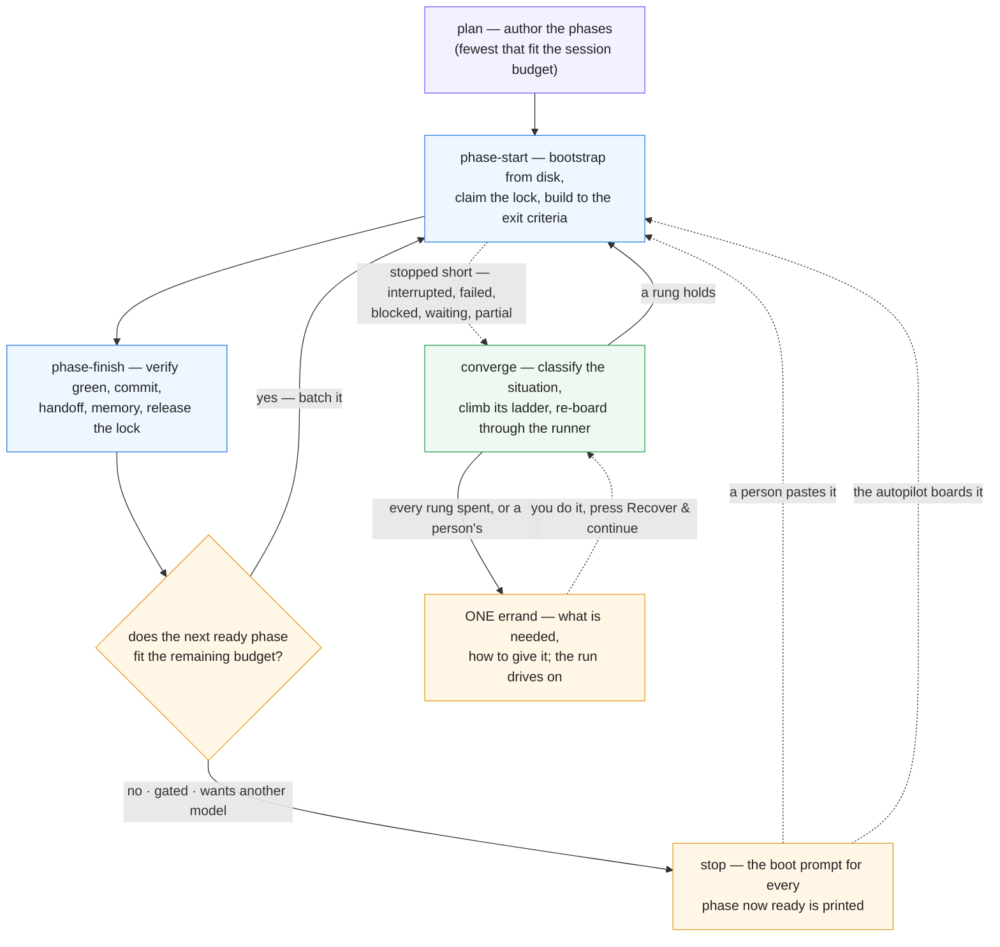

# The loop

> The autopilot's specification. How a plan runs itself, how a stopped phase is *read* rather than
> guessed at, what the machine tries before it asks you, how sessions see each other, and what is
> still — deliberately — a person's. The hand-driven procedure is `SKILL.md`; the console's controls
> are [What you control](controls.md) and [`viewer/README.md`](../viewer/README.md) §The autopilot.
> Everything below names the code that does it, so a claim can be checked against the thing.

## Three modes, one property

A session runs in one of three modes it picks itself: **plan** (no plan exists — author the phases and
start the roots), **phase-start** (bootstrap a phase from disk, claim it, build it), **phase-finish**
(verify, commit, hand off, batch into the next phase or stop). The property the whole system stands on:
**phase-start bootstraps from disk only** — the plan, the dependency handoffs, the memory entry, the
board (`scripts/phase-graph.sh`, the only truth for done / ready / waiting). A fresh session that
cannot start cold from those was handed a deficient handoff, and *that* is the bug to fix.



The dashed edges are what changed in 2.3.0. **Stop is not terminal** any more: a phase that stopped
short is classified and climbed; the boot prompt is still the only author of a fresh boarding
(`phase-graph.sh --boot-prompt`), but the runner may append a brief to it (`resume` · `unblock` ·
`continue` · `closeout`) and may `--resume` the phase's own session instead. The disk-only invariant
therefore holds for the **fresh** brief and is deliberately relaxed for the others — a resumed
session keeps its context on purpose.

## The autopilot in one paragraph

Phase Console's runner (`viewer/server/runner/`) drives a plan with **one unattended `claude -p` per
phase**, the board from `phase-graph.sh`, the §Verification commands from the plan, the handoff from
the session. A session tells the runner how it ended through the **outcome protocol**
(`scripts/phase-outcome.sh` → one JSON file at `PE_OUTCOME_FILE`: `complete` · `blocked` ·
`needs-human` · `waiting-external` · `partial` · `no-defect`); prose never counts. The runner verifies, re-reads the
board, and boards whatever is ready next under the scheduler's admission (scopes, locks, usage). Every
automatic act is a journal line on the run (`runs/<instance>/<slug>/run-<id>.jsonl`), bounded by count
**and dollars**, and yields to an operator's Stop. The CONVERGENCE loop never dispatches a reviewer; the
ladder does, as a rung inside a run — `qa-pending` resumes the phase's own session and asks it to
dispatch the fresh-context subagent the gate requires, and `qa-failed` asks for a fresh one and a new
verdict. That paragraph was
true before 2.3.0; what follows is what it does when a phase does **not** simply finish.

## Situations — reading a stopped phase

`viewer/server/runner/situation.ts` collects **evidence** for a phase once — the board's word
(`phase-graph.sh --memory-block`), the handoff (`{exists, status, outstanding}`), the run's record
(status, attempts, session, verification, closeout, halt kind), the lock (`phase-lock.sh status`:
owner, host, lease, `session=`, and the registry's presence for it), work in the tree (dirty files,
commits since the attempt), the transcript (turns, cost), a declared outcome, the gate kind, the MCP
preflight, health issues, a live-session hit — and `classifySituation(evidence)` (pure) answers with
**one** of sixteen words. The vocabulary is `viewer/shared/situation-model.js`, imported by the server,
the client and the tests by identity, so a chip, a journal line and an errand can never disagree.

| id | actor | label | it means |
|---|---|---|---|
| `superseded` | none | Superseded | the board reads the phase done; the record is history |
| `qa-failed` | machine | QA failed | a recorded `fail` holds the dependents — the ladder retries the verdict |
| `qa-pending` | machine | QA pending | the plan gates on QA and none is recorded — nobody scheduled the review |
| `foreign-live` | wait | Another session is in it | a LIVE session holds the lock — queue, never fight |
| `foreign-stale` | machine | Stale foreign claim | an expired claim over unfinished work, nobody in it |
| `waiting-external` | wait | Waiting on the outside | the session declared a clock it does not control |
| `gated-manual` | person | Gate needs a person | a `manual` gate, unapproved |
| `mcp-unavailable` | machine | MCP server unreachable | a server the phase needs did not connect |
| `resource-wall` | machine | Resource wall | `:usage` `:auth` `:budget` `:model` |
| `blocked-declared` | machine | Declared blocked | the handoff says blocked — `:lock` `:permission` `:credential` `:gate` `:external` `:unknown` |
| `plan-broken` | machine | Plan needs repair | lint, an unreadable plan, no runnable §Verification (`:lint` `:unreadable` `:verification` `:<issue>`) — **only when nothing was declared** |
| `verify-red` | machine | Verification red | the work is there; §Verification is not green |
| `done-unrecorded` | machine | Done, unrecorded | verification green, no complete handoff |
| `work-in-progress` | machine | Work in progress | started, not finished (an `in-progress` handoff, a dirty tree, a `partial`) |
| `never-started` | machine | Never started | no work, no handoff — the session died in bootstrap. **Sub-kinds read from the exit's own words** (`classifyExitSaid`): `sleep`, `refusal`, `skill-missing` — 40 of 226 sessions exited `turns: 0, costUsd: 0`, and their `said` named three different causes that all took the one rung `reboard-fresh`. An exit naming none of the three keeps the bare situation and the old path |
| `unknown` | person | Unclassified | fits nothing above — a person reads the evidence |

**Testimony outranks the console's own claim about the paperwork.** `blocked-declared` sits ABOVE
`plan-broken` (2026-08-30): a session that declared a blocker, or wrote a `blocked` handoff, is saying
what is wrong with the phase, while the commonest plan-health error — `stale-handoff` — is raised BY
that very handoff. The console answered "the box is unreachable" with "your plan is broken, run
validate.sh" 92 times, for plans whose `validate.sh` was green. All three `plan-broken` arms are now
guarded by "nothing declared a park or a blocker", `stale-handoff` is a **warning** rather than an
error, and when a `plan-broken` card is raised it quotes the issue that raised it instead of
prescribing a lint that is already passing.

**A halt is either about the phase or about the run.** `shared/recovery-model.js` splits `HALT_KINDS`
into `PHASE_HALT_KINDS` (`verify-failed` · `no-handoff` · `phase-blocked` · `needs-human` ·
`waiting-external-timeout` · `verification-preflight` · `mcp-preflight` · `recovery-failed` ·
`orphaned-session` · `phase-crashed` · `worktree-merge`) and `RUN_HALT_KINDS` (`budget` ·
`failure-streak` · `models-exhausted` · `run-preflight` · `plan-unreadable` · `plan-lint` ·
`runner-crashed`). A phase-level kind calls `settlePhase()`, which writes `record.halt` and leaves the
run driving its other candidates; a run-level kind calls `halt()` and stops everything. Before the
split, one phase's red verification drained every queued sibling lane — `phase.not-started` "the run
was stopped / halted while this phase waited for its scope" appears **125×** in the corpus, re-read
later as `never-started` and answered by re-boarding phases that had never had a chance. What still
stops a genuinely broken plan is the **streak**: `settlePhase` asks `failure-streak` on every
phase-level ending. The classifier reads `rec.halt ?? state.halt`.

**A declaration is spent by the session, not by the boarding.** `record.declared` is deleted only by
`consumeDeclaration(record, why)` under four named licences — `new-outcome` (the session declared
something else), `board-closed` (the board now reads the phase done), `session-productive` (a resumed
session produced a turn, a tool call or a result) and `retry` (a person superseded it) — each
journalled `phase.declaration-consumed`. Boarding used to delete it BEFORE the spawn, so a resume that
queued, hit the lock-wait cap or failed to start lost the testimony for good, and the phase's next
classification read "no handoff, no declaration" and called the plan broken.

The **actor** is the hinge: `machine` has a ladder; `person` gets an errand at once; `wait` settles
itself; `none` is nothing wrong. Classification is journalled as `phase.situation {situation, sub,
label, why[]}` and cached on the record (`PhaseRecord.situation {key, at, why}`) for the table and the
Ways-forward strip. The diagnosis endpoint (`GET /api/run/:slug/diagnosis/:phase`) returns the
situation with the evidence lines it read.

## The ladder — what the machine tries before it asks

`viewer/server/runner/ladder.ts` climbs; the **table** is `viewer/shared/ladder-model.js`
(`RUNGS_BY_SITUATION`), so the client shows the same rungs in the same words. Per situation, an
ordered list of **rungs** — a vehicle plus parameters — climbed in order, **never the same rung twice
for one situation on one phase**, and bounded by the caps below. A rung's record is pushed *before*
the spend (`accountRung`: `phase.rung {situation, rung, params, brief, vehicle, attempt}`) and settled
when the session ends (`settleRung`: `fixed` · `no-defect` · `superseded` · `failed`), so a console
that dies mid-rung still remembers it tried.

| situation | rungs, in climb order (→ an errand at the end) |
|---|---|
| `never-started` | **Re-board fresh** (the engine's boot prompt; the record resets to pending) |
| `never-started:sleep` | **Resume the same session** (`--resume` — the machine slept mid-response, so the transcript is intact and a fresh board would throw it away) → **Re-board fresh** |
| `never-started:refusal` | *(no rungs — an errand at once)* the same prompt gets the same refusal, so re-boarding is spending to learn nothing |
| `never-started:skill-missing` | *(no rungs — an errand at once)* the CLI answered `Unknown command:`; the next attempt runs the same broken install |
| `work-in-progress` | **Continue in its own session** (`--resume`, "you are RESUMING — read git status first") → **Board fresh with a resume brief** → **Board fresh, stronger** (next model/effort) |
| `done-unrecorded` | **Finish in its own session** (verify, commit, handoff — nothing else) → **Close out with a new agent** |
| `verify-red` | **Resume with the failure** (the failing commands and their output) → **Fix with a stronger new agent** |
| `qa-pending` | **Run QA and record the verdict** (resumes the phase's own session to dispatch the fresh-context QA subagent the plan's gate requires, then record `pass`/`fail`/`waived` with `qa-record.sh`) → **Review with a fresh session** (a session boarded from the boot prompt, through the QA loop's `qa-rerun`, for a phase whose own session cannot be resumed) |
| `qa-failed` | **Fix what QA found, then re-record** (its own session, carrying the report) → **Fix what QA found with a new agent** (a fresh agent at a stronger model) |
| `blocked-declared:lock` | **Queue behind the lock** (woken by the docs watcher, the lease, the idle poll) |
| `blocked-declared:external` | **Park and poll the refs** → **Park for a while** |
| `blocked-declared:unknown` | **One bounded unblock session** — the own session (or a fresh one with an unblock brief) carrying the Outstanding text, explicitly allowed to do the work |
| `blocked-declared:credential` / `:permission` / `:gate` | — (a person's: the errand at once; a `permission` wall names the policy to widen or the step to do by hand) |
| `resource-wall:usage` | **Switch to an account with headroom** → **Switch model** → **Wait for the window** |
| `resource-wall:auth` | **Switch to a signed-in account** |
| `resource-wall:budget` | **Raise the budget once** (within the policy cap) |
| `resource-wall:model` | **Wait for the first model's window** |
| `mcp-unavailable` | **Wait for the server** (the `require` park's clock) → **Continue without it** |
| `plan-broken` | **Deterministic repair** (`scripts/repair-artefacts.sh` — free, no session; needs `--allow-writes`, else the ladder falls through) → **Repair the plan with a repair session** |
| `foreign-stale` | **Take over the stale claim** → then the work-in-progress ladder |
| `waiting-external` | **Re-check what it waits on** |
| `foreign-live` · `gated-manual` · `superseded` · `unknown` | — (queue · errand · nothing · errand) |

**Caps** (`nextRung` refuses with a sentence; every one is a preference in Settings ▸ Automation):
3 rungs **and** $100 per phase (`ladderPerPhaseRungs`, `ladderPerPhaseUsd`) · 10 and $400 per run
(`ladderPerRunRungs`, `ladderPerRunUsd`) · $600 per day per console (`ladderPerDayUsd`). Why dollars
as well as counts: the old healer counted launches, and a $40 session followed by two $6 closeouts and
a $20 console closeout was "within budget".

**The two QA rungs have a budget of their own, and an exit the ladder does not take.** `qaMaxRounds`
(default 3) counts *failed rounds on one phase* — which the `ladder*` caps cannot express, since a
round driven from inside a phase's own session is neither a rung nor, usually, a separate charge. When
it is spent the `qa-failed` rung refuses, and since issue #11 the errand **names the operator's verb**
rather than describing the situation again:

> Read the latest QA report (…) and press **Fix & re-QA** on the phase, which runs the fix-and-review
> loop again with settings and a round budget of its own. **Re-run QA** reviews again without a fix
> session…; **Waive with a reason** records `waived`…

It names them and **launches nothing**. That is the deliberate seam between the two systems: the
ladder is what the machine tries before it asks, and an exhausted budget is the run declining to spend
more — re-arming it is a decision with a price, so it is offered rather than taken. The verb itself
(`POST /api/run/<slug>/qa-recover`) runs its own bounded loop outside the ladder, with its own
settings, its own round budget and its own journal kinds (`phase.qa-recover` → `phase.qa-round` →
`phase.qa-recovered` | `phase.qa-exhausted`), and parks with one errand of its own when *that* budget
goes. `autoRecover` gates the ladder's automatic climbing exactly as before; it has never gated a verb
an operator pressed. Full account: `docs/qa-gating.md` §Three ways past a recorded `fail`.

**Briefs.** A rung that re-boards sets a `boardingHint {situation, rung, brief, sessionId?,
instruction?, escalate?}` on the record; boarding reads it once and assembles the prompt: `fresh` is
the engine's boot prompt alone; `resume` appends the resume brief (SKILL.md Mode 2 "RESUMING" plus the
evidence — the handoff's status, the uncommitted paths, the last verification, the session's last
words); `unblock` appends the handoff's Outstanding text and the permission to do the work; `continue`
and `closeout` are instructions to the phase's **own** session (`claude -p --resume`). The engine's
boot prompt is never rewritten — `phase-graph.sh --boot-prompt` stays the only author.

**The errand.** When the ladder is exhausted — or the situation was a person's to begin with — the
phase is parked with **one** `Errand {phase, situation, tried[], need, how, at, said?}` (`errandFor`, the
`need`/`how` word-book in `ladder.ts`): what is needed, how to give it, and what the autopilot already
tried so nobody repeats it by hand — plus, when the session's own last words ARE the evidence (a
refusal, an unloadable skill), `said`, verbatim: the `need`/`how` are fixed sentences and by
construction cannot quote what was refused. Journalled as `phase.errand` (or `run.errand` for a wall with no
phase), announced once under the `needs-you` push category, shown on every Ways-forward surface, the
run's banner and the dashboard's **Waiting on you**. **The run keeps driving everything else** — it
halts only when nothing can proceed. `failure-streak` counts ladder exhaustions, not attempts.

## Convergence — it keeps looking

`viewer/server/converge.ts`: `planConvergence(facts)` (pure) decides, `executeConvergence` acts,
`ConvergeScheduler` runs them. **Triggers:** at boot · on a docs change (2 s debounce) · every
`convergeEveryMs` per open plan (default 5 min, floor 30 s, 0 = timer off) · 60 s after any halt · on
**Recover & continue** (the `recover` verb). **One pass, in order:**

1. **Reconcile-close** — records the board has overtaken flip to `done` ("closed outside this run");
   halts anchored to them dissolve. Reconcile *closes*, never re-runs (CLAUDE.md).
2. **Classify** every non-done phase of the plan's latest run (the situation above).
3. **Climb** for runs stopped **not by the operator** — `parked` / `halted` / `interrupted`, or paused
   by the system (`stoppedBy: 'system'`, a console shutdown); never a run a person paused or stopped,
   never a `resolved` one. The ladder's rung is driven **through the runner** —
   `startRun({resumeRunId, reboard: [{phase, situation, rung}]})` resets the records to `pending` with
   a `boardingHint` — never a second orchestration beside it.
4. **Release lock debris** — locks held by runs this console knows are dead, or by a session the
   registry shows **ended**; journalled `run.lock-debris-released`.
5. **Re-arm** lock-cap parks whose lock is gone (`phase.lock-cap-rearmed`).
6. **Resume at boot** the lanes a restart killed — but only once somebody has said so. Since 3.5.0
   `resumeAtBoot` ships on **`ask`**: the pass registers the run and journals `run.resume-asked`,
   launching nothing, and the app puts the question in front of whoever opens it next
   (`POST /api/boot-resume`). Answered *continue* — or set to `auto` — each killed lane resumes its
   own session, `phase.resume-at-boot`, at most `MAX_BOOT_RESUMES` (3) in a row per phase, then an
   errand. Answered *not now*, the run is left exactly as the restart left it and the pass skips it;
   `off` writes the errand straight away.
7. **Health** — records ahead of the board surface as a health issue, not a silent contradiction.

A pass that healed nothing remembers its fingerprint and does not run the healer again until something
changes; the operator's press always asks afresh. The pass is journalled as `run.converge {trigger,
action: relaunch|heal, why, reboard[], rearm[], launched, phase, situation, rung}` (or
`run.converge-failed`), and the flattened report rides the event stream as **`run:converge`** and
answers `GET /api/converge` (`{automatic, everyMs, pending[], running[], reports[]}`) — the Pulse's
**Converge** line ("re-boarded P12 (Never started → Re-board fresh) · released a stale claim on P3")
is that view, and Now's *Running now* band states whether the loop runs by itself on this console.
`--no-converge` keeps the automatic passes off while Recover & continue still works; a console without
`--allow-run` never converges (it cannot start anything).

## The watch clock — evidence the console did not produce

`viewer/server/watch-scheduler.ts`, beside `ConvergeScheduler` and deliberately **not** part of it.
Convergence asks *has the situation changed* on a five-minute sweep, over evidence that is all
internal — the run, the board, the locks, the gate stamp. A declared watch ref asks *has the world
changed*, on a clock nobody here controls. Coupling them cost two days on
`aug-create-order-filters-remediation` p12: a workflow run finished at 02:14 and was not looked at
until a sweep happened to visit that plan, behind a `noops` latch that had every right to say
nothing had changed — because from the console's own point of view, nothing had.

**What is watched:** every phase of every non-finished run that carries refs (`declared.watch`
first — the session's own testimony — else `record.watch`), plus a `lock:` ref derived from
`waitingOn` for a phase queued behind another claim. At most 8 refs per phase, the same bound
`phase-outcome.sh` puts on `--watch`.

**The schemes, and what each means by LANDED:**

| scheme | shape | landed when | asked every | trusts |
|---|---|---|---|---|
| `gh:` run | `gh:owner/repo#run/<id>` | the run reaches `completed`, whatever its conclusion | 2 min | fixed argv, never a shell |
| `gh:` pr | `gh:owner/repo#pr/<n>` | the PR leaves `OPEN` (merged **or** closed) | 5 min | same |
| `date:` / `until:` | `date:<ISO8601>` | `now ≥ t` | **once**, at its instant | arithmetic; nothing executes |
| `lock:` | `lock:<slug>/<phase>` | nothing holds that phase's scope — no lock, a lapsed lease, or a holder whose session **ended** | 1 min | the console's own lock store (a GRANT is not seen — see the phase-2 handoff) |
| `cmd:` | `cmd:<command>` or `cmd:"<command>"` | the command exits 0 | 5 min, **≤ 12 runs per phase** | the policy §Verification gets (NOT read-only — `npm ci` passes it), 60 s, `watchCmdRefs` |

The scheduler's own timer fires at `min(nextDueAt)` with a **60 s floor**, so a ref due in thirty
seconds does not buy a wake in thirty seconds. One probe per ref per pass, however many plans
declared it.

**Four states, and one of them is not a state.** `pending` · `landed` · `unknown` (could not ask —
no `gh`, no auth, a deleted run, no oracle wired; the caller behaves exactly as it did before this
existed) · `refused`, which is terminal: the read-only policy or the operator's switch said this
console will never run this command, so it is journalled once (`phase.watch-refused`) and dropped
from the rotation rather than argued with every minute.

**`cmd:` is an execution surface**, and the only one here. The command goes through the same policy
and the same spawn a plan's §Verification gets (`runSingleCommand`) — a denylist of mutating verbs,
an inverted allowlist for verbs that reach off this machine, a process-group kill on the timeout —
so a `cmd:` ref can do nothing a §Verification bullet in the same plan could not already do,
unattended, on the same clock. It is still gated twice: `--allow-run`, and the `watchCmdRefs`
preference (default on), because it is the one scheme whose refs are **written** by a session rather
than read by one.

**What it writes:** `record.watchState = {at, refs[{ref, scheme, state, detail, checkedAt,
nextDueAt, runs?, deliveredAt?}]}` — a CONTRACT, persisted with the run, written additively so a ref
not probed this pass keeps its row (rows for refs no longer declared are pruned). `runs` counts
`cmd:` executions against `MAX_CMD_RUNS_PER_PHASE`; `deliveredAt` marks the last delivery that
actually launched a resume — history, not a gate (below).
`watchChecked` is still written for readers older than it. `phase.watch-checked` is journalled on
TRANSITION only, and `phase.watch-landed` **once per landing**, not once per delivery.
`clearWatchBookkeeping()` (`runner/state.ts`) is the one writer that clears it, and every reset path
goes through it — a stale `landed` row retires its ref for ever, so a ref cleared from `watchChecked`
alone would never be watched again.

**A landing is handed to the healer**, which decides what it means: `resumeOnWatchLanded` writes
`record.declared.landed = {ref, detail, at, resumes}` — on the declaration, so the two are retired
together — journals `phase.watch-landed`, and resumes the phase's own session with an instruction
that **names the conclusion**. A run that ended `cancelled` is not a result to read: the session is
told to decide whether to re-run it, because "re-check it now" against a cancelled run is how a
resumed session becomes a resumed loop. A landing is **re-offered** on a short clock until the healer
acts on it — so a freeze, a capped admission or a failed spawn does not lose it — and re-probed
never, because the world's answer is final. `record.watchResumes` bounds the offers at
`MAX_BOOT_RESUMES` (3); after that the landing becomes an errand and the row retires. It also retires
the moment the declaration it answers is spent.

The offer is held back by the things that actually KNOW, never by a stamp or a clock: while the
healer's own drive promise has not settled (`resumeInFlight`) the landing is not offered again, and
while the resumed session runs the record's own status already excludes the phase. When the drive
settles, the healer inspects what it left behind — `record.endedAt` moved, a runner driving — and a
delivery that launched nothing is **un-charged**, so the offer returns on the next cadence. A
`deferred` — a freeze, `--allow-run` off, a drive already in flight — spends nothing and is asked
again. This replaced two earlier designs measured wrong: a clock could not tell a running resume
from one that never happened (three offers burned in three minutes), and a receipt signed the moment
`recoverPhase` was *called* gated a landing for ever when the call resolved without launching —
silently, with no errand (QA rounds 2–3, G1/H1). `deliveredAt` remains on the row as history: the
last delivery that really launched.

**And a due ref is a change.** `evidenceFingerprint` carries `min(nextDueAt)`; while something is
overdue the term becomes the current minute, which advances — so the "found nothing to climb" latch
cannot hide a landing across the sweep. It is the one deliberate exception to *the clock is not part
of the evidence*, and it earns it by measuring something outside this console rather than inside it.

## Waiting behind another claim — what may be capped

A phase queued behind somebody else's scope waits in the scheduler. The **two-hour lock-wait cap**
turns that wait into an honest park with the holder named — but only for the one shape it was ever
for: a **foreign `lock` whose session the registry does not report `live`**, i.e. a claim nobody is
behind. `isCappableBlocker` (`runner/scheduler.ts`) is the single rule, asked at both cap sites
(admission and boarding's belt-check):

| blocker | capped? | why |
|---|---|---|
| `clock` (boarding window, session cap, usage window) | no | it ends at a moment already known |
| `grant` / `reserved` — a sibling lane of this console | **no** | pipelining, not contention: the lane finishes and the waiter boards. A hung lane is bounded by its OWN watchdog and lease, which act on the hung lane rather than on the innocent one behind it |
| `lock`, registry says `live` | **no** | a person (or another console) is working; their lease is not a deadline for them |
| `lock`, presence `unknown` or absent | yes, at 2 h | a claim nobody is behind |

`record.lockWaitSince` is cumulative so a re-arm of the same wait keeps measuring it — and
`endLockWait(record)` stops it the moment the wait ends any OTHER way (a declaration, a park, a
successful claim). Left standing, one 25.4-hour queue made the next admission compute
`remaining = max(0, 2h − 25.4h) = 0` and fire its cap 1 ms after `phase.queued`. `phase.queued` also
carries `headKind` and, when the head holder is a lock with a lease, an `eta`.

## Resource walls — the ladder at the top of the run

Walls that used to stop a run for a person climb their first rung inline in the runner
(`viewer/server/runner/runner.ts`), each behind its preference with the default **on**:

- **Auth** — the run's account fails the preflight: the ranked candidates (`Accounts.rankAccounts`)
  are *probed* and the first that signs in takes the run (`run.account-switched`); none → the
  `run-preflight` park with an errand naming the sign-in (`autoAccountSwitch`).
- **Usage window past the 12 h ceiling** — under `onLimit: wait` the switch is tried first; with no
  account to pay, the run waits on the window itself (restart-safe; `run.waiting`); `pause` keeps its
  word (`autoAccountSwitch`).
- **Models exhausted** — the first model's reset is waited for once (`phase.model-window-wait`), then
  the same session retries on it; no reset inside 12 h → the `models-exhausted` halt as before.
- **Budget** — a spent run budget is raised **once** by `budgetAutoRaisePct` (25 %) within the ladder's
  per-run USD cap (`run.budget-raised`, `state.budgetRaise`); the second exhaustion halts `budget` with
  the errand.
- **PR pending** — on a work-branch run the last done leaf's own session is resumed to open the PR;
  only when none can be resumed does the branch end "awaiting its PR".
- **MCP `require`** — the park carries its clock (`record.mcpPark`); after `mcpRequireTimeoutMs`
  (30 min; 0 = wait forever) the phase continues without the servers under its own `continue` policy,
  the errand recorded, the operator told once (`phase.mcp-require-timeout`); a server that heals
  sooner requeues it sooner.

## Presence and sync — sessions that see each other

**The hook.** `scripts/session-hook.sh` is a user-scope Claude Code hook for `SessionStart`, `Stop`
(the per-turn heartbeat) and `SessionEnd` (hooks fire in `-p` too, merged with the per-run
`--settings` hooks). Fail-open, always exit 0, 2 s timeout, `PHASE_CONSOLE_HOOK_OFF=1` is a no-op. It
reads the payload on stdin (64 KiB cap; the first occurrence of each field wins, so a quoted payload
inside `last_assistant_message` cannot spoof `cwd` or `session_id`; both the CLI's `source`/`reason`
and the documented `session_start_reason`/`session_end_reason` spellings are read), resolves the
console that owns `cwd` (`viewer/shared/instances.mjs shell --cwd`, like `bin/btw`; `PHASE_CONSOLE_URL`
overrides), and POSTs one JSON line — `{version, session_id, event, cwd, transcript_path, source,
reason, owner: $PE_OWNER, scope: $PE_SCOPE, user, host, pid, root, at}` — to `POST /hooks/session`
(loopback only; a request through the `--remote` proxy is 403 — forged presence from a phone could
release a real lock). A console that is down gets the record in `INSTANCE_STATE_DIR/sessions/inbox/`
and drains it on the next boot. At SessionStart it prints `additionalContext` telling the session its
own id and to pass `--session <id>` (or that the runner already exported `PE_SESSION_ID`). **Installed**
from Settings ▸ Automation ▸ Session presence or `phase-console install-hooks` / `uninstall-hooks` / `hooks-status`
(`viewer/server/hooks-install.ts`): it rewrites only the `hooks` value's byte span in
`~/.claude/settings.json` — every other byte, key order, indent and EOL kept; idempotent; an entry
pointing at another checkout is refreshed in place; an unparseable file is refused.

**The registry.** `viewer/server/sessions/registry.ts` folds the events into `SessionRecord {sessionId,
kind: autopilot|agent|foreign, cwd, root, transcript, owner, scope, user, host, pid, startedAt,
lastSeen, endedAt, reason, turns}` and answers **presence** in three values: **`ended`** (SessionEnd
seen, or the recorded `claude` pid is gone), **`live`** (seen within 24 h and nothing says otherwise),
**`unknown`** (nobody reports it — an un-hooked machine, a lock with no `session=`). `GET
/api/sessions/registry` lists them with the plan and phase they work; the SSE `sessions` event carries
the `foreign` list; the Pulse draws live ones as lanes of their own kind (Terminal session · Console
agent · Autopilot session) and `#/sessions` lists the rest.

**The lock names its session.** `phase-lock.sh claim` writes `session=<id>` from `--session`,
`$PE_SESSION_ID` (runner-injected — `spawn.ts` mints the id before the child exists and passes the same
value as `--session-id`) or `$CLAUDE_CODE_SESSION_ID`. **Correlation** is strong when a lock's
`session=` is a registered id, weak (display only — the Pulse says "probably") when only
`<user>@<host>` and time match. **What each reader does:** a lock whose session is `ended` is **debris
now**, whatever the lease says — the scheduler admits the phase queued behind it, the boarding
belt-check releases it and boards, the convergence loop releases the file; a lock held by a `live`
session reads `foreign-live` (queue, never fight, re-evaluate on the next presence change); `unknown`
falls back to the lease rules. Nothing ever releases on a weak match.

**Human sessions' outcomes.** `phase-outcome.sh` in a session nobody supervises (no `PE_OUTCOME_FILE`)
writes the same declaration into the console's inbox — `~/.local/state/phase-console/runs/<instance>/
<slug>/outcomes/phase-NN.json` (the instance id `sha256(root)[:8]-basename`, `scripts/instance.sh`) —
and a running console with `--allow-run` picks it up: a live runner for the plan declares it through
`Runner.declareOutcome` (`phase.outcome {by:'unsupervised'}`); with no live runner the service edits
the plan's latest run (or creates one, `run.start {by:'unsupervised'}`). `waiting-external` parks the
phase `waiting` and resumes **that** session at the window; **`partial --reason budget|context|other`**
("work remains, resume me") re-boards it with a resume of that session; `blocked` / `needs-human` /
`complete` / `no-defect` are kept as declared evidence and announced once. A declaration older than 24 h is history.

## What is still a person's

The autopilot asks **once, with a named errand**, only here: a **sign-in** (no session can give it);
a **`manual` gate** (numbered steps on the Gate card, Approve or `gate-approve.sh`); a **credential** a
session named and none holds; a **tool the run's permission policy refused** (widen the policy for the
plan, or do the step by hand — never strike a deny rule); an approval or sign-off the session said it
waits for; a **blocker no machine category fits** after its one unblock session; **a QA verdict the
ladder could not produce**
(it tries first — `qa-pending` and `qa-failed` are `machine`, and their rungs resume the phase's own
session to dispatch the fresh-context subagent and record the verdict; the errand is what rung
exhaustion leaves); **destructive or irreversible acts** and **publishing** (push, tag,
release — the deny list holds them on every profile); and anything `unknown`. Everything else it decides,
within the caps, and journals — and an errand it has written **stands**: the sweep re-reads it every
five minutes and rewrites nothing unless the ask itself changed, so the clock on the card is when
it was first asked.

## Liveness — is the lane that is nominally working actually working?

The loop above answers "why did this phase STOP". It has never answered "is this phase, which has not
stopped, doing anything" — and from every surface the console had, three quite different lanes looked
identical: one wedged on a `Bash` call waiting for a prompt nobody would type, one producing eleven
turns of prose because the file it needed was not there, and one about to commit. All three read
`running`, with a spinner, at four cents a minute.

Every live lane now carries `{lastOutputAt, lastToolUseAt, turnsSinceLastTool, commitsSinceStart,
treeDirty, openTool?, stall?}` on `GET /api/run/:slug` (`liveness[]`) and on its own phase record, and
a 60-second `unref` ticker evaluates three signals against it:

| signal | when | what it means |
|---|---|---|
| `stalemate` | `stallStalemateAttempts` attempts in a row ended with nothing committed and a clean tree | re-running has stopped being a remedy |
| `silent` | no output at all for `stallSilentMs`; names the tool call open longest | still spending, producing nothing |
| `spinning` | `stallSpinTurns` turns in a row with no tool call | talking rather than working |
| `retrying` | `stallRetryBurst` API retries in a row with nothing productive between | pinned inside the CLI's own retry watchdog — alive, spending, unable to reach the API |
| `external-wait` | a Bash call matching the shared vocabulary (`EXTERNAL_WAIT`, `scripts/verify.env`) open for `stallExternalWaitMs` — or `stallLocalJobMs` when it waits on a job the session started ITSELF | not working and not broken: waiting, while holding an exclusive lock |

Worst-first: a lane that is both spinning and now silent reports `silent`, the newer and harder fact.
**A phase inside its own §Verification is exempt** — the session has exited and the commands own the
next several minutes, so a real test suite would otherwise raise a card on every phase of every plan.
A subagent's turns are not the phase's: a delegating phase sits with its own conversation stopped
while an `Explore` agent works, and counting that as activity would hide exactly the stretch worth
asking about.

One episode is one card. The ticker journals only transitions (`phase.stall` when a signal starts,
`phase.liveness` when it clears), emits `run:liveness`, and announces once under the **`stalled`**
push category — **on by default and deliberately not urgent**: nothing is blocked on the operator and
the run has not stopped. It is the money question, not the permission question, and a card that
buzzed a wrist for it would be muted within a week.

**Once, and then once more.** That reasoning is right at minute ten and wrong at minute seventy, and
minute seventy is what happened: of the first 26 stall cards this console ever issued, every one was
`urgent: false`, none was ever repeated, and a 70-minute hang cost one quiet buzz an hour earlier. A
stall still open at **`stallEscalateMs`** (45 min shipped, `STALL_ESCALATE_MS`) is therefore
re-announced **exactly once, urgently** — never a loop, so the "we do not buzz for every stall"
vocabulary survives intact. And **every stall card now stands itself down**, the way a `halted` card
always has: resolved when the lane produces work again, when its phase ends, or when the run settles.
Before that, the category had no resolution path at all — 26 raised, 0 resolved, against 34 of 37
`halted` cards resolving themselves — so the inbox accumulated every stall it had ever seen.

**A retry storm is not silence.** 450 `phase.api-retry` events were journalled and read by nothing, so
a lane retrying every ~16 minutes looked exactly like a lane thinking, and one run died to a quota
climb with no stall ever raised. `liveness.retries {count, since}` now rides the same payload — the
same counter `retrying` is judged on, so the lane chip and the stall signal cannot disagree — and it
is absent while the count is zero.

**v1 is display, notification and manual verbs — not a ladder situation.** The inbox row for a silent
lane carries `steer` (a canned nudge), `freeze` and `stop {phase}`, and the operator decides. Making
`stalled` a situation with rungs of its own is the v2 path, and it is deliberately not taken yet: the
ladder's one hard promise is never the same rung twice per situation per phase, and a signal that can
re-fire on every attempt of a long phase needs its false-positive rate measured on real runs before it
is allowed to spend money.

The inbox's own five stall rows (`shared/attention-model.js` `STALL_KINDS`) are a longer-clocked
superset, computed on read: `session-silent` (30 min — the runner notices at ten and announces, the
inbox asks a person at thirty), `queued-behind-lock` (1 h, half the runner's own lock-wait cap),
`park-overdue` (10 min past a park's own `parkedUntil` — the arming failed, not the waiting),
`plan-idle` (7 d, read from the Insights computation rather than re-derived) and `verify-hanging`
(15 min — the runtime half of lint F16).

## Rulings — what a session decided

The outcome protocol is about endings. A **ruling** is about the judgement calls a session makes on
the way, which nobody else can reconstruct:

```bash
bash scripts/phase-outcome.sh <slug> <N> ruling --kind ambiguity|deviation|deferral \
  --what "<what you decided>" --why "<why>" [--cost-if-wrong "<what it costs if this was wrong>"]
```

One appended NDJSON line to `$PE_RULINGS_FILE` — the runner injects it — or, unsupervised, to
`runs/<instance>/<slug>/rulings.ndjson` beside the outcomes inbox. The console's watcher folds new
lines into the run (`run.rulings`), journals each as `phase.ruling`, serves the whole ledger at
`GET /api/run/:slug/rulings`, puts this phase's on the diagnosis, and raises an `fyi` inbox row per
recent one. Acknowledging appends a further line rather than editing the file, so a reader never
races a live session.

**Nothing acts on a ruling** — it does not park a phase, climb the ladder or change what runs next,
and declaring one is never a substitute for declaring an outcome. That is the point: it costs one
line, so a session in doubt records it instead of hoping the handoff paragraph survives the skim.

## The journal, by name

| line | who | when |
|---|---|---|
| `phase.situation {situation, sub, label, why}` | runner, healer | every classification |
| `phase.rung {situation, rung, params, brief, vehicle, attempt}` · `phase.rung-settled {rung, outcome}` | runner, healer | a rung climbed / settled |
| `phase.ladder-skipped` · `phase.ladder-deferred {remaining}` | runner | auto-recovery off for the run / a rung this console cannot drive yet |
| `phase.errand {…errand, label, reason}` · `run.errand` | runner, healer, converge | the one ask |
| `phase.reboard-requested {situation, rung, brief, sessionId}` · `phase.resume-at-boot` | runner, converge | a re-board by rung / a killed lane resumed |
| `run.converge {trigger, action, why, reboard, rearm, launched, phase, situation, rung}` · `run.converge-failed` | converge | a pass acted |
| `run.lock-debris-released {phase, owner, session?, why}` · `phase.lock-debris-released {by:'boarding'}` · `phase.lock-cap-rearmed` | converge, boarding | debris released / a lock wait re-armed |
| `run.account-switched` · `phase.account-switch` · `run.waiting` · `phase.model-window-wait` · `phase.model-window-retry` · `run.budget-raised` · `phase.mcp-require-timeout` · `phase.pr-session` | runner | the resource walls |
| `phase.outcome {status, reason, resumeAfter, watch, by?}` · `phase.outcome-ignored` · `phase.outcome-partial` · `run.start {by:'unsupervised'}` | runner, service | outcomes, a hand session's included |
| `run.plan-recover {step}` | service | Recover & continue's three steps |
| `phase.stall {signal, since, detail, attempt}` · `phase.liveness {cleared, turnsSinceLastTool, commitsSinceStart, treeDirty}` | runner | a stall episode opened / cleared — once each, never per tick |
| `phase.tool-denied {tool, rule, matched?}` | service | a tool call the console refused — `rule` is a deny-list rule, or `in-turn-wait` for a Bash call that would have waited inside the turn |
| `phase.auto-nudged {detail, since, scope?, parkAfterMs?}` · `phase.auto-nudge-refused` | runner | one line written into the session's stdin, and the refusal recorded separately when the write did not reach it. `scope: 'local'` is the local-job ladder, not the silent one |
| `phase.external-wait {detail, since, scope, command, watch, thresholdMs}` | runner | the wait that parked the phase, whose clock it was on, and any `cmd:` ref lifted out of the loop's own condition |
| `phase.ruling {id, kind, what, why?, costIfWrong?, sessionId?, at}` | runner, service | a decision a session recorded |
| `phase.halted {reason, kind}` | runner | a PHASE-level halt kind settled the phase (`settlePhase`); the run keeps its other candidates |
| `phase.declaration-consumed {why, status, reason?, watch?, at?, next?}` | runner | the session's declaration was spent, and by which of the four licences |
| `phase.queued {scope, headKind?, eta?, waitingOn}` | runner | a lane joined the queue, and what is at the head of it |
| `phase.watch-checked {ref, scheme, state, detail}` · `phase.watch-refused {…}` | watch clock | a ref changed state / the policy will never run this command |
| `phase.watch-landed {ref, detail}` | healer | the world answered, and the phase's own session is resumed |
| `phase.retry-storm-recycled {detail, since, attempt, category, sessionId}` · `phase.retry-storm-parked {until, resetsAt, category, …}` | runner | a lane doing nothing but retrying was recycled / parked on the wall |

## The knobs (Settings ▸ Automation, `POST /api/prefs`, `server/config.ts`)

| key | default | means |
|---|---|---|
| `autoRecoverByDefault` | on | new runs opt into the ladder (`run.autoRecover`) |
| `autoContinueRecovery` | on | a run resumes by itself when a recovery leaves the board fixed |
| `ladderPerPhaseRungs` / `ladderPerPhaseUsd` | 3 / 100 | the per-phase caps |
| `ladderPerRunRungs` / `ladderPerRunUsd` | 10 / 400 | the per-run caps |
| `ladderPerDayUsd` | 600 | the per-console-day cap |
| `convergeEveryMs` | 300 000 | the sweep (0 = timer off; boot, change and post-halt passes stay) |
| `watchCmdRefs` | on | may the watch clock RUN a `cmd:` ref? Off ⇒ such a ref reads `unknown` (not `refused` — the console did not ask). Gated again by `--allow-run` |
| `unblockAttempts` | on | one bounded unblock session on a `blocked-declared:unknown` |
| `staleClaimTakeover` | on | take over an expired foreign claim over unfinished work |
| `resumeAtBoot` | **ask** | what to do about the runs this console's own restart stopped — `ask` (put the question on screen, start nothing), `auto` (the pre-3.5 behaviour), `off` (write the errand) |
| `autoAccountSwitch` | on | switch accounts at an auth or a far usage wall |
| `delegateHumanGates` | **off** | a `manual` gate is briefed to the phase's own session to VERIFY against citable evidence and clear (recorded `by: ai-session-delegated`), or STOP naming the condition it could not verify — instead of stopping the run for a person |
| `allowUnverifiedPhases` | **off** | a phase whose plan states NO §Verification boards and passes on its handoff alone (`phase.verify-waived`), instead of parking at boarding with "add a command, then Retry"; a declared bullet the runner cannot read still parks |
| `ladderExtendOnProgress` | **off** | when a phase's rung count is spent but the newest settled rung landed commits, ONE more rung is granted, once per phase (`phase.ladder-extended`); the dollar caps stand |
| `budgetAutoRaisePct` | 25 | the one budget raise (0 = never) |
| `mcpRequireTimeoutMs` | 1 800 000 | a `require` park's clock (0 = wait forever) |
| `stallSilentMs` | 600 000 | no output at all for this long is `silent` (suppressed while verifying) |
| `stallSpinTurns` | 6 | this many turns with no tool call is `spinning` |
| `stallStalemateAttempts` | 3 | this many attempts that changed nothing is `stalemate` |
| `stallRetryBurst` | 5 | this many API retries in a row with nothing between is `retrying` |
| `stallExternalWaitMs` | 300 000 | a Bash call waiting on SOMEBODY ELSE's clock, open this long, parks the phase and releases its lock |
| `stallLocalJobMs` | 2 700 000 | the same call when it waits on a job the session started itself: one nudge first, and the park only after this. Nine times the number above, deliberately — parking a lane 40 min into its own suite releases nothing and throws the suite away |
| `stallEscalateMs` | 2 700 000 | an unresolved stall is re-announced once, urgently, after this (0 = never). Not a detector: it does not change what a stall IS, which is why it is `STALL_ESCALATE_MS` beside `STALL_DEFAULTS` rather than inside it |
| `mcpPolicy`, `gitMode`, `openPrOnComplete`, `repoGuard`, `attachDefaultSkills`, `qaByDefault` | — | the launch defaults ([controls.md](controls.md)) |

**The rows above are the ones this document explains, not the ones that exist.** Every event kind
the console emits, with its sink and its meaning, is in
[journal-events.md](journal-events.md), which a parity test holds to the code in both directions.

## Where it lives

`viewer/shared/{situation-model,ladder-model,recovery-model,attention-model}.js` (the vocabularies,
imported by identity) ·
`viewer/server/runner/{situation,ladder,runner,scheduler,spawn,outcome,liveness,rulings}.ts` ·
`viewer/server/{converge,service,hooks-install}.ts` · `viewer/server/sessions/registry.ts` ·
`scripts/{session-hook,instance,phase-lock,phase-outcome}.sh` · the client's
`components/{errand,recovery-actions,pulse}.tsx`, `features/now/index.tsx`,
`features/settings/{automation,ladder,hooks}.tsx` · tests: `viewer/test/{situation,ladder,converge,
auto-recovery,sessions-*,hooks-install,liveness,rulings}.test.ts` and
`tests/unit/{session-hook,lock,outcome}.bats`.

---
