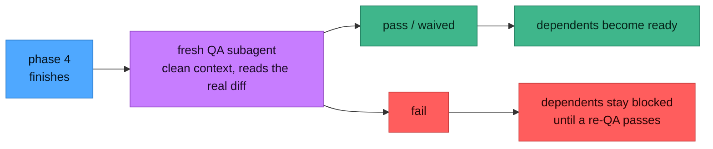

# QA gating

QA here is not a report you read afterwards. It is a **gate**: with it on, a phase's dependents are
not allowed to start until that phase is verified. That is the whole point — a broken phase should not
silently propagate into everything built on top of it.



**Turning it on.** Ask for it at plan time and the plan records `**QA gate:** on`. Ask for it later
and the next phase-finish picks it up. Check which regime a plan is in:

```bash
scripts/phase-graph.sh checkout-rewrite --qa-mode      # off | on <reason> | waived <reason>
```

**Why a *fresh* subagent.** The session that built the phase shares the blind spots of the code it
just wrote. QA runs in a subagent with a clean context that reads the real diff cold — it verifies
commits against `git show` rather than trusting the handoff's summary, checks every exit criterion,
sweeps for correctness, edge cases, error handling, regressions and security, and runs the tests. A
suite that is green but does not actually cover the criteria is a **fail**, not a pass.

**The verdicts.**

| Verdict | Meaning | Effect on dependents |
|---|---|---|
| `pass` | every exit criterion met with evidence, tests green, no high/critical findings | released |
| `fail` | a criterion unmet, a high/critical finding, or red tests | **held** until a re-QA passes |
| `waived` | genuinely not applicable, justified explicitly | released |
| `pending` | recorded but not yet judged | held |

On a fail, the QA subagent does **not** fix the code — it returns the verdict and enumerates the
follow-ups. The finishing session owns the fix, and re-QA is always a *new* fresh subagent, never a
re-run inside the one that failed. Results are committed and pushed so the gate reaches every clone.

Verdicts are recorded only through `scripts/qa-record.sh` — an idempotent upsert. Never hand-edit
`test-status.md`.

## Rounds

A phase is often reviewed more than once, and until 2026-09-02 nothing in the model knew it. `qa-record.sh`
was an upsert into a three-column table, so re-recording **overwrote** the previous verdict: one row per
phase, for ever. Rounds nevertheless happened — the sessions invented a filename convention to keep them,
and on one measured run there were 22 report files across 12 phases, one of them five rounds deep, with
`test-status.md` pointing at the last and the other ten invisible to the engine, the API and every screen.

A round is a real thing now:

- **`test-status.md` holds two tables.** `## QA status` keeps ONE row per phase — the current verdict, the
  only thing that gates — with a fourth `Round` column saying which review produced it. `## QA rounds` is
  the append-only ledger of every `(phase, round)`.

  ```markdown
  ## QA status

  | Phase | Result | Report                          | Round |
  |------:|--------|---------------------------------|------:|
  | 4     | pass   | reports/phase-04-qa-round2.md   |     2 |

  ## QA rounds

  | Phase | Round | Result | Report                        | Recorded   |
  |------:|------:|--------|-------------------------------|------------|
  | 4     |     1 | fail   | reports/phase-04-qa.md        | 2026-09-01 |
  | 4     |     2 | pass   | reports/phase-04-qa-round2.md | 2026-09-02 |
  ```

  Keeping one row per phase in the gating table is deliberate: a second row would have made "the verdict"
  ambiguous in four readers at once. History is additive instead.
- **A three-column table still reads.** `Result` is the third cell either way, so every table written
  before rounds gates exactly as it did; the header is upgraded in place on the next record, and rows
  nobody has re-recorded simply have no round — which is what they genuinely are.
- **Round 1 keeps the plain report name; every later round carries its own** (`phase-NN-qa-roundR.md`).
  Seven surfaces hand that name out — the engine's `--qa-prompt` and `--boot-prompt`, the console's
  QA launcher, the runner's at-finish chase, both QA rungs of the ladder, and the Stop hook that holds
  a session whose verdict is still owed — and all seven ask ONE chooser: the round ledger's highest
  plus one, advanced past any report already on disk. So neither a re-review nor a reviewer who wrote
  a report and recorded nothing sends the next one to an occupied filename. It is a convention the
  tools uphold rather than a lock: `--report` writes whatever it is passed. (`viewer/server/qa-round.ts`
  and `qa_next_round()` are the two halves; `viewer/test/qa-round.test.ts` holds them equal over a
  corpus of table shapes, asks six of the seven surfaces over the shape that hurt — the warm chase is
  held on a real `Runner` by `viewer/test/verify-signoff.test.ts` — and scans
  `server/` and `shared/` for any other `reports/phase-…` literal — the enumeration is what catches a
  caller that hard-codes a round while dutifully building its path; the scan only catches the literal.)
  `qa-record.sh` numbers a record without `--round` from the report's filename when it carries one, and
  a bare record from the highest conventional report on disk — so a reviewer that forgets `--round`
  still lands in the slot the brief named.
- **A record without `--round` is numbered from its report's filename** (`-roundR.md` is round R, a
  plain name is round 1), a bare record from the highest conventional report on disk from previous + 1,
  and only then previous + 1; re-recording the same round replaces it. `pending` is recorded roundless
  and `--round` is refused with it: a round is a review that happened.

> **Update every installed copy of `qa-record.sh` together.** A table with a ledger is readable by
> an older copy, but not *writable* by one: the pre-rounds upsert deletes every row whose first cell
> is the phase number, and the ledger's rows begin with exactly that — so a verdict recorded through
> a stale copy silently takes that phase's history with it, and appends its own row inside the
> ledger's table. This tree installs in several places at once (each console's own clone, a stamped
> copy under `~/.claude/skills`, the plugin), so "backward compatible" here means *readable by*,
> never *writable by*. Update them together: `git pull` in each clone, `phase-console install-skill
> --force` for a stamped copy, `/plugin update phased-execution` for the plugin.

```bash
scripts/phase-graph.sh <slug> --qa-result N     # the current verdict — the one that gates
scripts/phase-graph.sh <slug> --qa-history N    # every round: round⇥result⇥report⇥recorded
```

## How many rounds QA may fail

There was no QA failure budget. `maxConsecutiveFailures` counts phase *attempt* failures and a `fail`
**verdict** never touched it; the `ladder*` caps count rungs and dollars, and a round driven from inside a
phase's own session is neither. So a phase could fail QA indefinitely without anything noticing.

**`qaMaxRounds` on the run** — default 3 — is the bound: *QA may fail N rounds on a phase, then stop.* At
the budget the `qa-failed` ladder refuses to climb, and what happens next is the plan's answer to
**`qa.exhausted`** — the `**QA exhausted:** waive|halt|<owner>` line in §Session budget or its
`## Decisions` row, else this console's Settings ▸ Automation ▸ Policy answers, else the shipped
`waive`:

| Answer | What happens at the spent budget |
|---|---|
| `waive` *(shipped)* | The console records `waived` itself, through the same `qa-record.sh` door as **Waive with a reason**, the reason naming the policy (`QA exhausted after N failed rounds — waived by policy (qa.exhausted: waive, from the plan)`). It journals `phase.policy-answered` and `phase.qa-waived {by: policy}`, raises no errand and pushes nothing, and the dependents release on the next board read; inside **Fix & re-QA** the run then parks, ready to Continue. The waiver is a write: on a console without `--allow-writes` it cannot be recorded, and the errand below stands with the reason. |
| `halt` | No waiver. The phase parks with ONE errand that names how many rounds went by and **which report describes the code as it stands** — the newest round's, not the plain `phase-NN-qa.md` the old ask pointed nowhere near. Inside **Fix & re-QA** the whole run halts `plan-deadlocked`, because a fail nobody may waive holds the dependents exactly as a deadlock does. |
| `<owner>` | No waiver. The phase parks with the same errand, and **Fix & re-QA** addresses it to that person (`The plan hands this verdict to <owner>`). |

Raise the budget from the run's settings if you want the autopilot to keep trying.

Three is the smallest number that lets the normal shape happen — QA fails, the builder fixes it, QA passes
— with one round of slack for a fix that misses. Above that the evidence is that nobody is converging.

## QA's own model and effort

QA used to inherit the builder's settings with no way past it: `record.model ?? state.model`. The review is
a different job from the build and is regularly worth a different tier in *either* direction — "build with
Fable at high, review with Opus at max", or a cheap reviewer over a mechanical phase. **`qaModel` and
`qaEffort`** on the run say so; absent, they mean exactly what they always meant, and a phase's own model
still answers before the run's.

Every round is now a first-class record on the run: `GET /api/runs` carries `phases[N].qa[]` — round,
verdict, report path, the session that produced it, the brief it was given, and what it spent — and the
Runs, Sessions and Autopilot surfaces render it. Before this, a QA pass was invisible on every run surface
except as a cost line.

## Three ways past a recorded `fail`

A recorded `fail` — and an unjudged `pending`, which holds dependents exactly as hard — is not
something you delete. `test-status.md` is append-and-upsert only, and the row survives every exit
below. What differs is whether the row keeps *holding the board*.

**1. Re-QA — the work is now correct.** A fresh subagent, a passing verdict, recorded through
`scripts/qa-record.sh`. This is the only exit that *clears* the failure rather than releasing it.

Since issue #11 this is a button rather than a chore. The phase page and the inbox row both carry
two or three verbs whenever the gate is HOLDING a phase — on `fail` **and** on `pending`, which hold
identically:

| Verb | What runs | Flag |
|---|---|---|
| **Fix & re-QA** (`POST /api/run/<slug>/qa-recover`) | The loop with settings of its own: a fix session carrying the last report's findings verbatim, which dispatches the reviewer itself and records round N+1 — repeating while rounds remain. `pass`/`waived` releases every dependent on the next board read; a spent round budget is answered by `qa.exhausted` (§ How many rounds QA may fail) — `waive` records the waiver, `halt` halts the run, an owner parks the phase with ONE errand naming the LAST report. Offered only on a `fail`: a pending verdict names no findings for a fix session to read. | `--allow-run` |
| **Re-run QA** (`POST /api/run/<slug>/qa-rerun`) | The review alone — no fix session. For a verdict that failed on the ENVIRONMENT rather than the work. | `--allow-run` |
| **Waive with a reason** (`POST /api/plans/<slug>/qa-waive`) | `waived` with the operator's words, through `qa-record.sh --reason`, into the `## QA waivers` section. Starts nothing, so it is write-class: a console that may write but may not run can still release a gate. | `--allow-writes` |

All three refuse on a phase with **no recorded verdict at all** — a "re-run" of a review that never
happened is a first review wearing the wrong name, and the round budget would count it as a failed
round. Start one with **QA this phase** instead.

**With no run at all, `qa-recover` mints one scoped to the phase** (`onlyPhases: [N]`), which is what
makes the verb work on a hand-driven plan — the case the ladder could never reach, because a ladder
only ever climbs inside a run somebody had already started. Without `--allow-run` the card is
disabled and prints the hand command instead of a dead button:

```bash
bash scripts/qa-record.sh <slug> <N> <pass|fail|waived> --report <path> --round <n>
bash scripts/phase-graph.sh <slug> --qa-prompt <N>     # the reviewer's brief
```

The loop journals `phase.qa-recover` → `phase.qa-round` (once per round) → `phase.qa-recovered` or
`phase.qa-exhausted` (carrying the `policy` and its `policySource`); a waiver journals `phase.qa-waived`. Its two settings are the run's, changeable
mid-run: `qaFixStrategy` (`resume` — the phase's own session, which already holds the context the
report is about — or `fresh`, boarded from the phase's boot prompt with the findings appended; the
loop falls back to `fresh` by itself when no session id survives) and `qaRoundBudgetUsd`, a hard stop
for ONE ROUND and never for the run. That last distinction is the reason it exists as its own number:
a loop under `phaseBudgetUsd` alone spends the phase's whole allowance on round one, and the round
that would have fixed it has nothing left.

**2. `**QA gate:** off` — release the gate, plan-wide.** One line in the plan's §Session budget:

```markdown
**QA gate:** off
```

`qa_mode()` resolves that to `waived (plan directive: QA gate: off)`, which sets `QA_GATING=0`. The
verdicts **stay recorded and stay reported** — the row is still in the file, the phase still shows its
verdict, `--qa-result` still answers — they simply stop holding dependents. Reach for this when the
gate has outlived its usefulness on a plan you are still running: the alternative used to be re-QA'ing
work nobody doubted, or closing a live plan to get past it. **One phase can opt out (or in) on its
own** with `- **QA:** off` in its §Phase section; the phase's word beats the plan's, and silence
inherits. Ask which level answered with `phase-graph.sh <slug> --qa-mode <N>`.

**3. Close the plan — the work no longer matters.** A dropped experiment with a red phase 3 would
otherwise report a failure at you forever:

```bash
scripts/close-plan.sh checkout-rewrite --reason "approach dropped after the spike"
```

A QA failure is a statement about **progress**, and a closed plan makes no claims about progress, so
its verdicts stop being reported. Nothing is erased: the row stays in `test-status.md`, the phase still
reads failed on the board, and search still finds all of it. Reopen the plan and the gate is exactly
where you left it, still holding.

The three are not interchangeable, and it is worth being precise about which one you want:

| | What it means | What it takes | The row afterwards |
|---|---|---|---|
| **Re-QA** | the work is now correct | a fresh subagent, a passing verdict | replaced by the new verdict |
| **`QA gate:` off** | the gate has outlived its use on a live plan | one line in §Session budget | recorded and reported, no longer holding |
| **Close** | the work no longer matters | a status and one line saying why | recorded, reported only on the closed plan's own board |

Re-QA is how you *clear* a failure. `**QA gate:** off` is how you stop *gating* on one. Closing is how
you stop *caring* about one. None pretends another happened.

> If a plan deadlocks entirely — nothing ready, nothing in flight — `phase-graph.sh --lint` emits
> **F19** naming the QA rows that hold every remaining phase, and points at these same exits.

---


## Turning QA on from the console

The console offers QA at every launch surface: a "QA gate" toggle on the run form and the phase
launcher, an activation checkbox on the review dialog, and a **QA by default** preference
(Settings ▸ Automation) that pre-ticks them for every plan. Launch-time activation goes through the
skill's own `--qa` path — it needs the console started with `--allow-writes` (activation writes
`test-status.md`), refuses loudly when it isn't, and backfills every already-finished phase as
`waived` so turning it on never retroactively holds the board.

One behaviour worth knowing before ticking it on a big plan: activation is plan-wide and sticky, and
**the autopilot will try to produce the verdict itself.** Since 2026-08-22 `qa-pending` and
`qa-failed` are `machine` situations with real ladder rungs: a pending row resumes the phase's own
session to dispatch the fresh-context QA subagent and record the verdict; a failed row resumes it with
the report to fix what QA named, then re-record, and escalates to a fresh agent at a stronger model if
that does not clear it. **Each of those costs a session**, and they draw on the same ladder caps as
every other rung. When the rungs are exhausted the plan's `qa.exhausted` answer decides: under the
shipped `waive` the console records the waiver itself and says so in the inbox's **Policy answered**
row; under `halt` or an owner's name the verdict is a person's, and you get an errand. You can still
record one yourself at any time, from the console's QA dialog or by hand with `qa-record.sh`.
